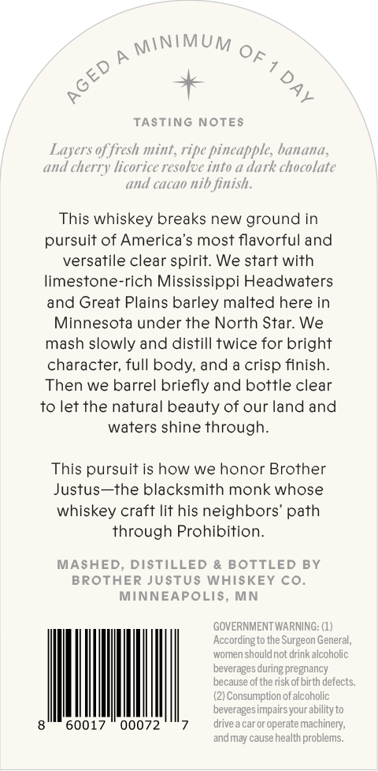
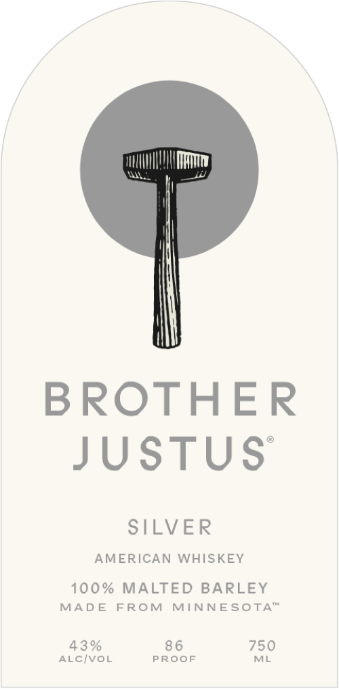

# TTB COLA Label Images - TTBID 26096001000341

**Brand Name:** BROTHER JUSTUS

**Issue Date:** 04/07/2026

**Origin Code:** 27

**Product Class/Type:** 140

**Source:** [TTB Public COLA Registry](https://ttbonline.gov/colasonline/viewColaDetails.do?action=publicFormDisplay&ttbid=26096001000341)

## Label Images

### Back Label

### Front Label

## Extracted Label Text

*Text extracted via OCR - may contain errors*

### Back Label

MINIMUM
A
TASTING NOTES
Layers of fresh mint, ripe pineapples banana,
(U d
licorice resolve into & dark chocolate
and cacao nib finish.
This whiskey breaks new ground in
pursuit of America's most flavorful and
versatile clear spirit: We start with
limestone-rich Mississippi Headwaters
and Great Plains barley malted here in
Minnesota under the North Star: We
mash slowly and distill twice for bright
character; full body, and a crisp finish_
Then we barrel briefly and bottle clear
to let the natural beauty of our land and
waters shine through_
This pursuit is how we honor Brother
Justus-the blacksmith monk whose
whiskey craft lit his neighbors' path
through Prohibition:
MASHED, DISTILLED & BOTTLED BY
BROTHER JUSTUs WHISKEY Co.
MINNEAPOLIS, MN
GOVERNMENT WARNING: (1)
Accordingto the Surgeon General,
women shouldnot drinkalcoholic
beverages during pregnancy
because of the risk of birth defects:
Consumption of alcoholic
beverages impairsyour ability to
60017
00072
drive
car or operate machinery;
and
cause health problems:
OF 1
AGED
{
cherry
Imaj

### Front Label

BROTHER
JUSTUS

SILVER
AMERICAN WHISKEY
100% MALTED BARLEY

MADE FROM MINNESOTA™

43% 86 750
ALC/VOL PROOF ML
