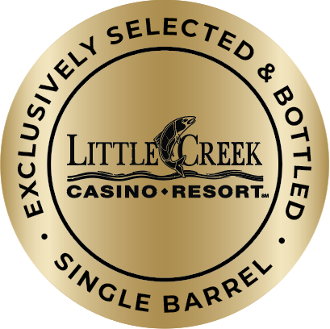
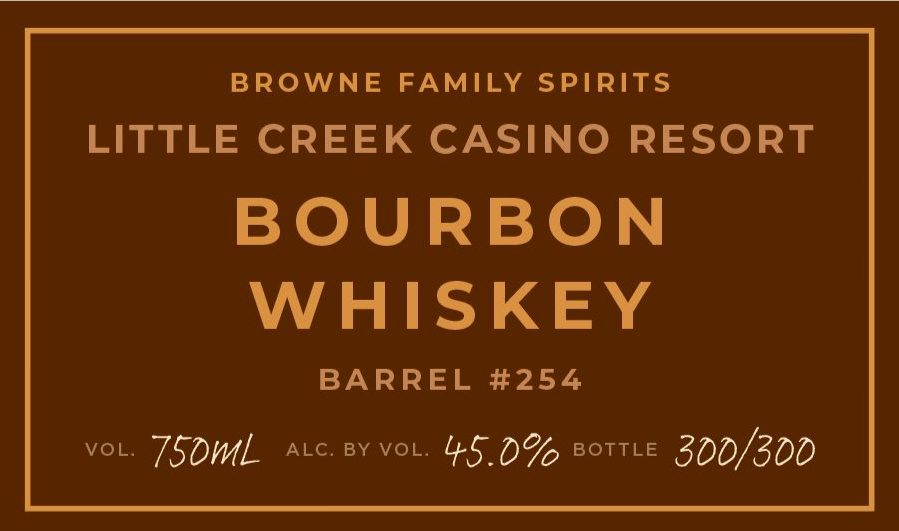
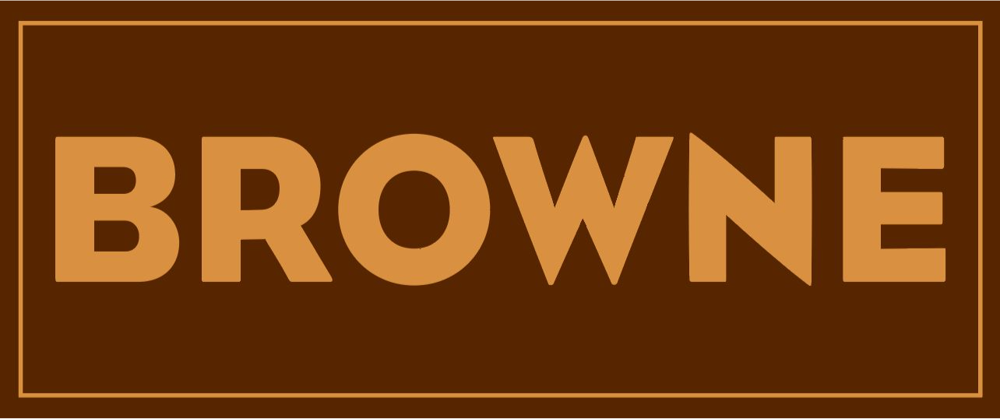
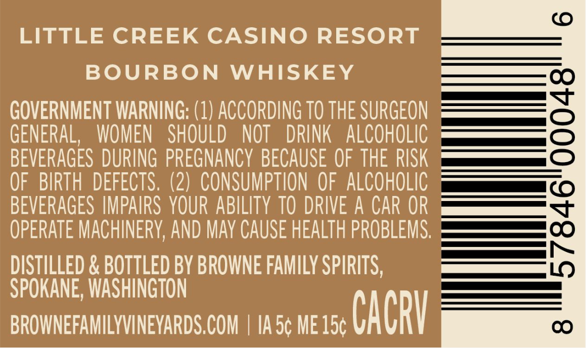

# TTB COLA Label Images - TTBID 26096001000360

**Brand Name:** BROWNE FAMILY SPIRITS

**Issue Date:** 04/08/2026

**Origin Code:** 07

**Product Class/Type:** 141

**Source:** [TTB Public COLA Registry](https://ttbonline.gov/colasonline/viewColaDetails.do?action=publicFormDisplay&ttbid=26096001000360)

## Label Images

### Front Label

### Label 1

### Label 2

### Label 3

## Extracted Label Text

*Text extracted via OCR - may contain errors*

*1 image(s) excluded: text did not meet readability threshold*

**Detected Proof:** 90

### Front Label

$
LITTLE
CREEK
)
CASINO-RESORT
SELECTED
ELY
(
SiNGLE
BARREL

### Label 1

BROWNE
FAMILY SPIRITS
LITTLE CREEK CASINO RESORT
BOURBON
WHISKEY
BARREL #254
VOL.
750mL
ALC. BY VOL.
45.0%
BOTTLE
300/300

### Label 3

(0
LITTLE CREEK CASINO RESORT
BOURBON
WHISKEY
GOVERNMENT WARNING: (1) ACCORDING TO THE SURGEON
3
GENERAL,   WOMEN
SHOULD
NOT
DRINK  alCohOLIC
BEVERAGES DURING  PREGNANCY  BECAUSE OF THE RISK
OF   BIRTH  DEFECTS. (2)   CONSUMPTION OF   ALCOHOLIC
BEVERAGES IMPAIRS YOUR ABILITY TO DRIVE A CAR OR
OPERATE MACHINERV, AND May CAUSe HEALTh PROBLEMS.
{
DISTILLED & BOTTLED BY BROWNE FAMILY SPIRITS ,
SPOKANE, WASHINGTON
BROWNEFAMILYVINEYARDS COM
Ia 5c ME 15c
CAcRV
