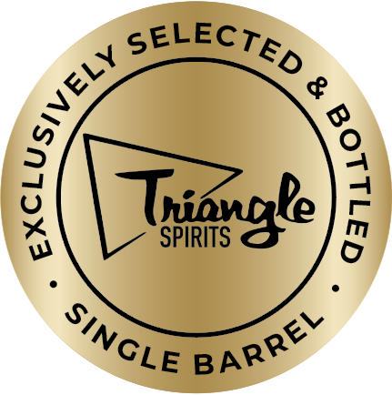
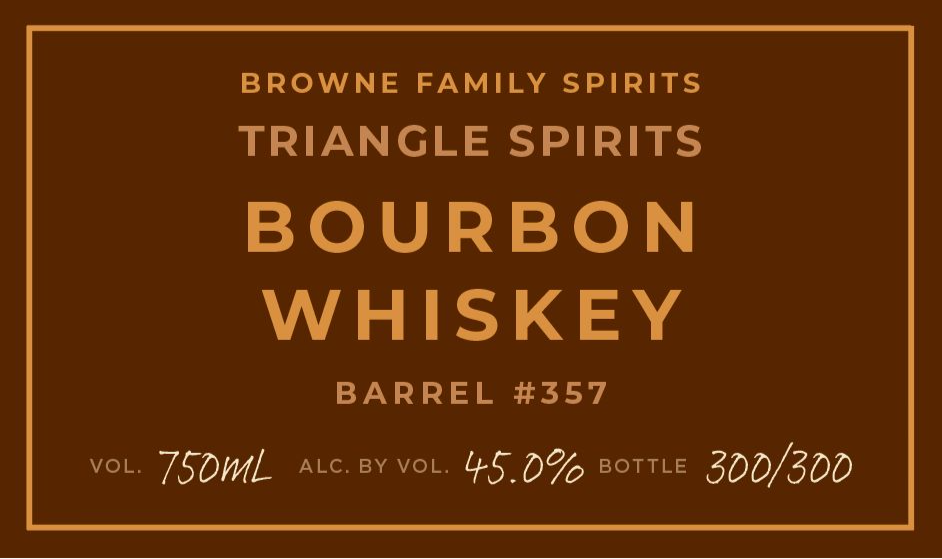
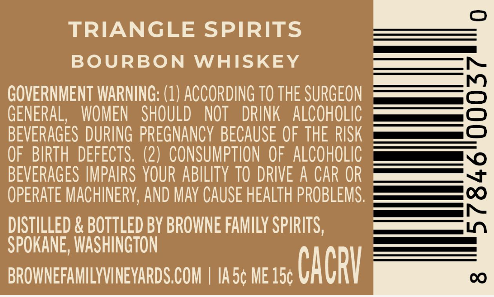

# TTB COLA Label Images - TTBID 26096001000371

**Brand Name:** BROWNE FAMILY SPIRITS

**Issue Date:** 04/07/2026

**Origin Code:** 07

**Product Class/Type:** 141

**Source:** [TTB Public COLA Registry](https://ttbonline.gov/colasonline/viewColaDetails.do?action=publicFormDisplay&ttbid=26096001000371)

## Label Images

### Front Label

### Label 1

### Label 2

### Label 3

## Extracted Label Text

*Text extracted via OCR - may contain errors*

*1 image(s) excluded: text did not meet readability threshold*

### Front Label

P
Tynggke
SPIRITS
)
SELECTED
(
SiNGLE
BARREL

### Label 1

BROWNE
FAMILY SPIRITS
TRIANGLE SPIRITS
BOURBON
WHISKEY
BARREL #357
VOL
750mL
ALC
BY VOL;
45.0% BOTTLE 300/300

### Label 3

TRIANGLE SPIRITS
BOURBON
WHISKEY
GOVERNMENT WARNING: (1) ACCORDING TO THE SURGEON
2
GENERAL,
WOMEN   SHOULD
NOT
DRINK
ALCOHOLIC
BEVERAGES DURING  PREGNANCY BECAUSE OF THE RISK
OF  BIRTH  DEFECTS. (2)   CONSUMPTION OF   ALCOHOLIC
BEVERAGES IMPAIRS YOUR ABILITY TO DRIVE A CAR OR
OPERATE MACHINErY; AND May CAuse HEALTh PROBLEMS,
;
DISTILLED & BOTTLED BY BROWNE FAMILY SPIRITS,
SPOKANE, WASHINGTON
BROWNEFAMILYVINEYARDS COM
IA 5c ME 15c
CAcRV
C
