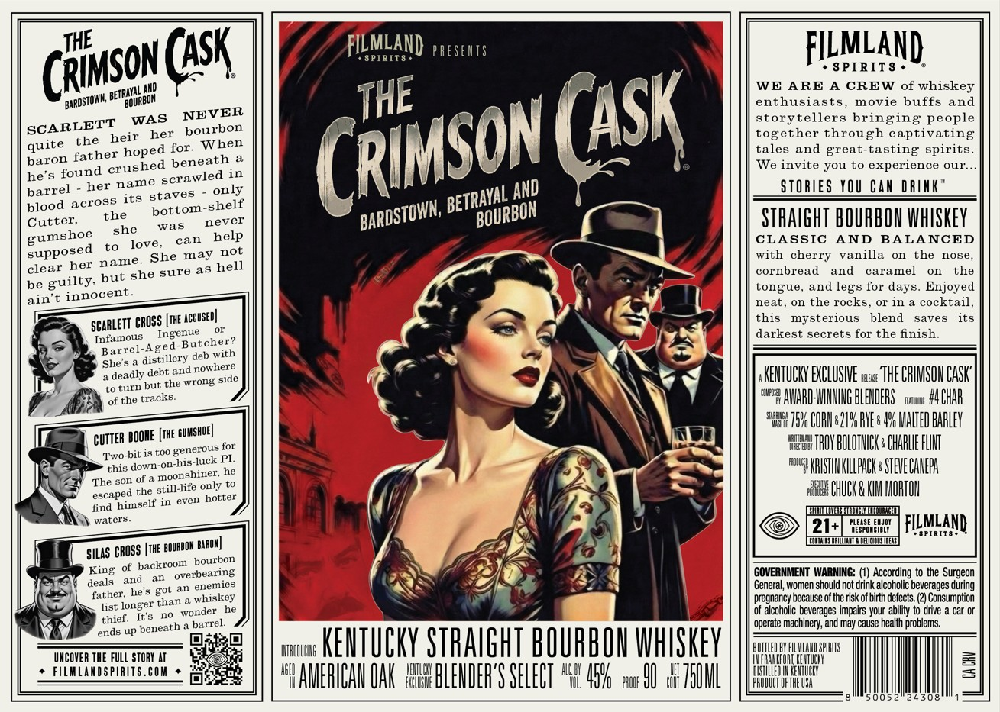
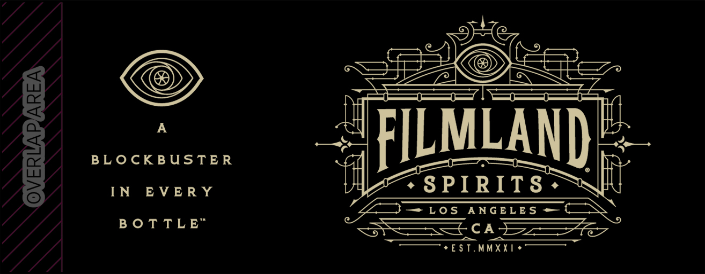

# TTB COLA Label Images - TTBID 26096001000396

**Brand Name:** FILMLAND SPIRITS

**Fanciful Name:** THE CRIMSON CASK

**Issue Date:** 04/07/2026

**Origin Code:** 22

**Product Class/Type:** 101

**Source:** [TTB Public COLA Registry](https://ttbonline.gov/colasonline/viewColaDetails.do?action=publicFormDisplay&ttbid=26096001000396)

## Label Images

### Label 1

### Label 2

### Label 3

## Extracted Label Text

*Text extracted via OCR - may contain errors*

*2 image(s) excluded: text did not meet readability threshold*

### Label 1

THE
(aSK
FILI
S PIRIT 8
MLAND preseuts
FILMLAND
SPIRIT8
WE ARE A CREW
of
whiskey
enthusiasts, movie buffs
and
SCARLETT
iWAs  Noubon
(ASK
togerhellehrough ciE Peolg
the
heir
for.
When
tales
and great-tasting spirits_
barorofather hoped
We invite you to experience
our
he's found
scrawled in
barrel
her name
only
AND
STORIES YOU Can DRIAK
blood across
its staves
shelf
Cutter
the
was
never
STHAIGHT BOURBON WHISKEY
she
can
help
CLASSIC
AND
BALANCED
to
love,
She may
not
with
cherry
vanilla
the
nose
clear her name
a5 hell
cornbread
and
caramel
on
the
be
guilty but
tongue,
and
for
Enjoyed
ain t
innocent_
neat
on the rocks_
O1' in a cocktail
SCARLETT
[the
this
mysterious
blend
saves
its
Infamous
Ingenue
darkest secrets for the finish
Aged-Butcher?
distillery deb with
She
deadly debt
wrong side
KENTUCKN EXCLUSHE wtx: 'THE CRIMSON CASk"
to turn but the
of the tracks_
wa AWRD:WHHNG BLEHDERS
Fhiai;
F4CHHR
75V CORHe21V RVE s 4Y MALTED BAALEY
CUTTER
[the GuMShOe]
istoo
generous for
THOY BOLUTHICK e CHAALE FLHT
Two-bit -
luck PI
down-on-his
F4! KRISTINKILPACK e STEVE CHNEPA
The son of
#olisaioely to
the
still-life
HHEHE CHUCK & KIH MORTOH
himself in
even hotter
find
[imid
waters_
21+
PLEISE
###F | FiLmLan)
SPIRITS
DI
md
SILAS CROSS [THE BOuRBOH
of backroom  bourbon
King
overbearing
GOVERNMENT WARNING:
According to the Surgeon
deals
an
General;, women should not drink alcoholic beverages during
father;
he's got
whiskey
pregnancy because of the risk of birth defects: (2) Consumption
list
longes than vonder
of alconolic: beverages impairs
ability to drve
car Or
thief:
barrel:
operate machinery; and may cause health problems
ends up
UHCOVER THE FulL STORY AT
ITHIUNHG
KENTuCKY STHAIGHT BOUPBOU WHISKEY
BHHHIH
HHHSPATS
FiLMLAADSPIRITS. COM
#YAMERICAU OAK  #BLEHIEF'S SELECT 4L8 45V   ww 9U  75UIL
PHHFUFTHEUT
00 5
(RIMSON
THE
BETRAYAL _
'BARDSTOWN;
'BOURBON
(RIMSON
NEVER
quite
hoped
beneath
BETRAYAL _
BARDSTOWN;
BOURBON
bottom-
gumshoe
supposed
sure
she
legs
days
accuSED]
CROSS
Barrel-
nowhere
and
BOOME
this
escaped
parov]
and
enemes
Your
It 5
beneath
