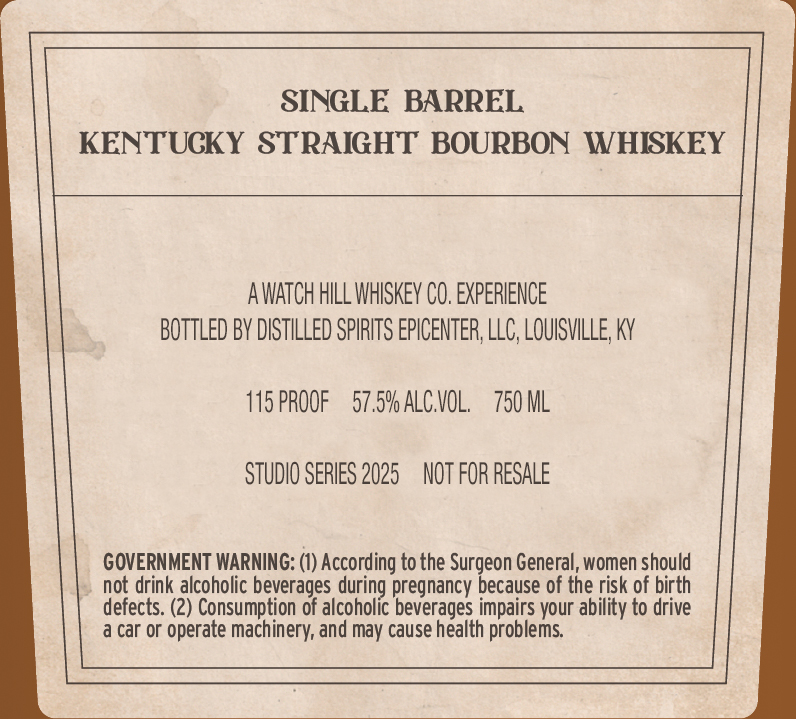

# TTB COLA Label Images - TTBID 26096001000558

**Brand Name:** STAVED BY GRACE

**Issue Date:** 04/09/2026

**Origin Code:** 22

**Product Class/Type:** 101

**Source:** [TTB Public COLA Registry](https://ttbonline.gov/colasonline/viewColaDetails.do?action=publicFormDisplay&ttbid=26096001000558)

## Label Images

### Back Label

### Front Label

## Extracted Label Text

*Text extracted via OCR - may contain errors*

**Detected Proof:** 115

### Back Label

SINGLE BARREL

KENTUCKY STRAIGHT BOURBON WHISKEY

AWATCH HILL WHISKEY CO. EXPERIENCE

BOTTLED BY DISTILLED SPIRITS EPICENTER, LLC, LOUISVILLE, KY

TISPROOF 57.5% ALC.VOL. 750 ML

STUDIO SERIES 2025 NOT FOR RESALE

GOVERNMENT WARNING: (1) According to the Surgeon General, women should

not drink alcoholic beverages during pregnancy because of the risk of birth

defects. (2) Consumption of alcoholic beverages impairs your ability to drive

a car or operate machinery, and may cause health problems.

### Front Label

STAVED
GRACE
KENTUCKY STRAIGHT
WHISKEY
SINGLE
BARREL =
BOURBON
