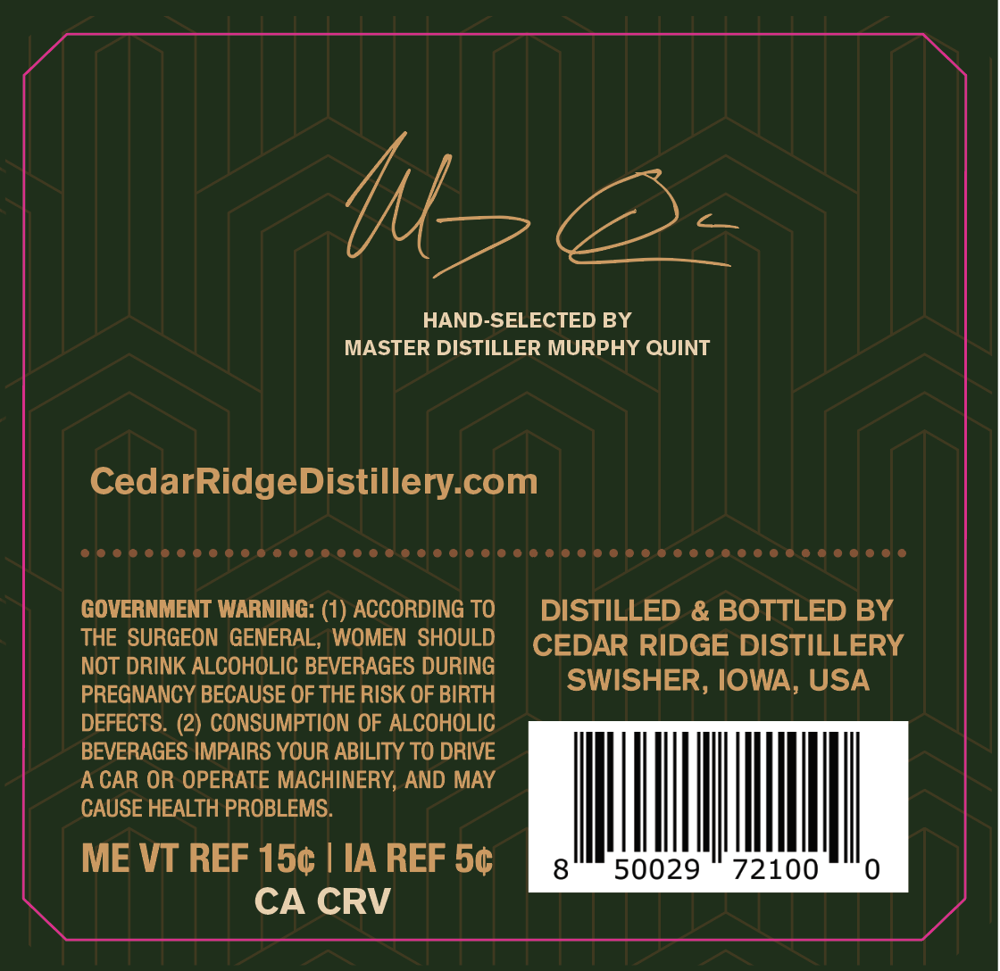
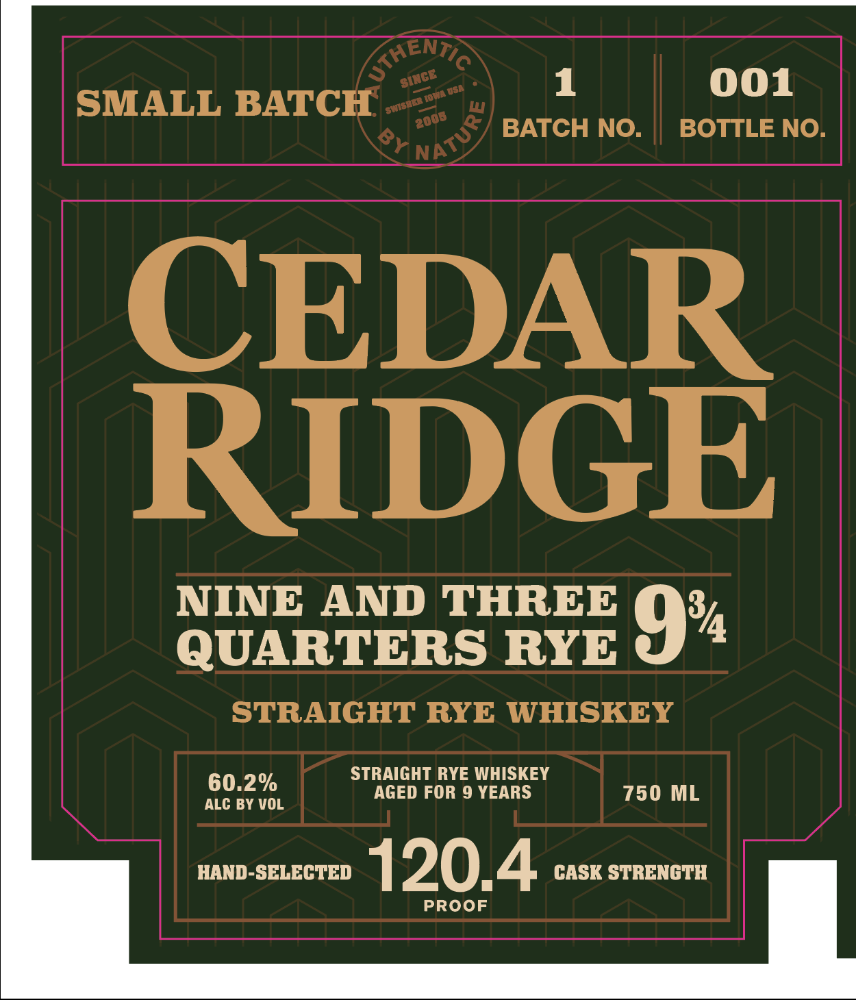

# TTB COLA Label Images - TTBID 26096001000778

**Brand Name:** CEDAR RIDGE

**Fanciful Name:** NINE AND THREE QUARTERS RYE

**Issue Date:** 04/08/2026

**Origin Code:** 20

**Product Class/Type:** 102

**Source:** [TTB Public COLA Registry](https://ttbonline.gov/colasonline/viewColaDetails.do?action=publicFormDisplay&ttbid=26096001000778)

## Label Images

### Back Label

### Front Label

## Extracted Label Text

*Text extracted via OCR - may contain errors*

**Detected Proof:** 120.4
**Detected Age:** 9 Years

### Back Label

Mls E+

HAND-SELECTED BY

MASTER DISTILLER MURPHY QUINT

CedarRidgeDistillery.com

COCHCOCHOOEHHSCOOCOEHOOOCOOOOEH HO OOO HEHOCOCOOOCODEEOOCOO®E

GOVERNMENT WARNING: (1) ACCORDING TO

DISTILLED & BOTTLED BY

THE SURGEON GENERAL, WOMEN SHOULD

CEDAR RIDGE DISTILLERY

NOT DRINK ALCOHOLIC BEVERAGES DURING

PREGNANCY BECAUSE OF THE RISK OF BIRTH

SWISHER, IOWA, USA

DEFECTS. (2) CONSUMPTION OF ALCOHOLIC

BEVERAGES IMPAIRS YOUR ABILITY TO DRIVE

ACAR OR OPERATE MACHINERY, AND MAY

CAUSE HEALTH PROBLEMS.

ME VT REF 15¢ | IA REF 5¢

MINN

CA CRV

### Front Label

1
001
SMALL BATCH
BATCH NO.
BOTTLE NO
CEDAR
RIDGE
NINE
AND THREE
374
QUARTERS RYE
9
STRAIGHT RYE WHISKEY
STRAIGHT RYE WHISKEY
60.2%
AGED FOR 9 YEARS
750 ML
ALC BY VOL
HAND-SELECTED
120.4
CASK STRENGTH
PROOF
GHEntio
SINGE
dsn
HIsaea I0wa E
NATURY
2006
