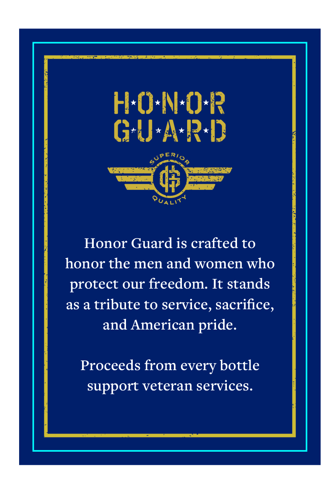
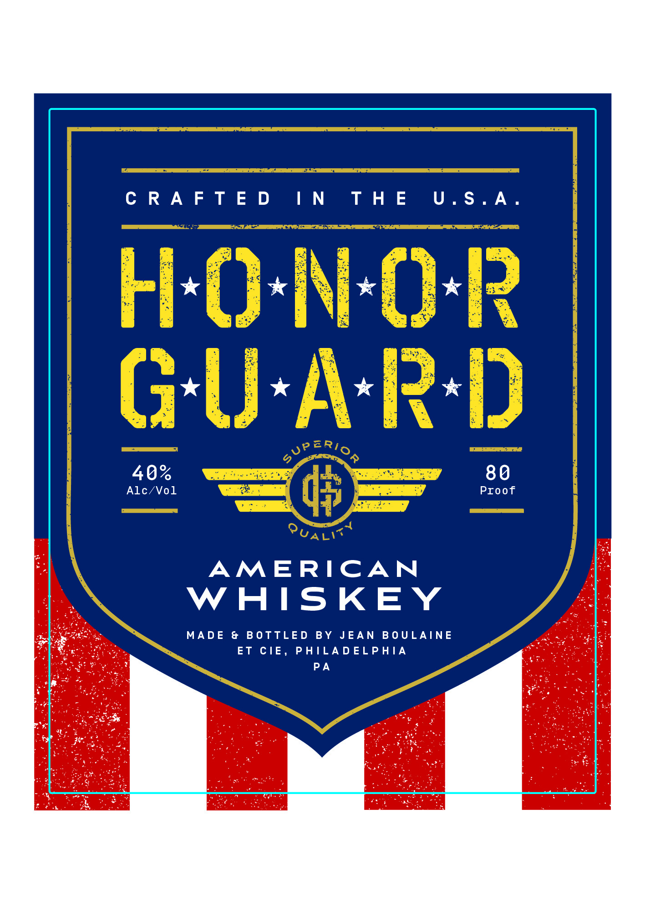
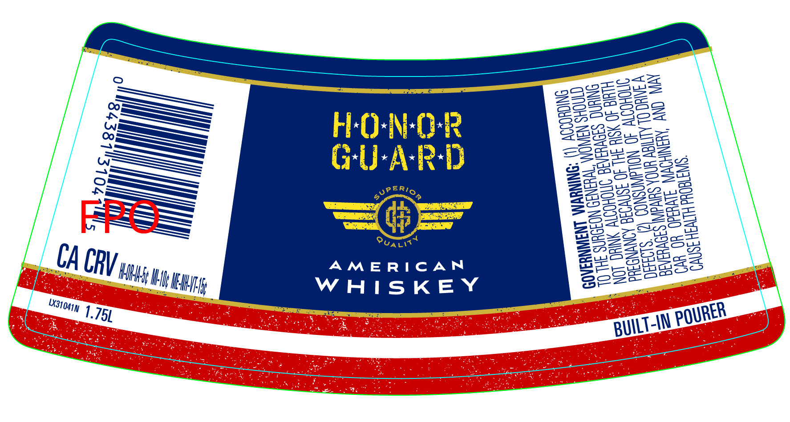

# TTB COLA Label Images - TTBID 26096001000811

**Brand Name:** HONOR GUARD

**Issue Date:** 04/13/2026

**Origin Code:** 39

**Product Class/Type:** 140

**Source:** [TTB Public COLA Registry](https://ttbonline.gov/colasonline/viewColaDetails.do?action=publicFormDisplay&ttbid=26096001000811)

## Label Images

### Back Label

### Label 1

### Label 3

## Extracted Label Text

*Text extracted via OCR - may contain errors*

*1 image(s) excluded: text did not meet readability threshold*

### Back Label

Honor Guard is crafted to
honor the men and women who
protect our freedom. It stands
as a tribute to service, sacrifice,
and American pride.

Proceeds from every bottle
support veteran services.

### Label 3

Ze

gAaseas=

rs)

=)

Dae

oases

—

eros

SO=at

HONOR

=o

BAwez

—

ao eu

omg

—=>=

=sS

mS Zt

Kec

= =7e)

—S==

GU-A-R-D

Bqweuwy,

ee

aS

PERG

S50

25S u5

Sos

=—>

mez

eck xe

—o-

SSS

= —

——S

Sz

C265

OBos

enone

pe

——=

—=

sa qo

a-*s

OS

Sunt

weer

ZAhASZOw

Oc

i}

cesses

295-2

AMERICAN

awe

at

eras

CC

RV tqy,

_

eos

oc

a

Hh eng

WHISKEY

“Stoaqy 1 75L

DITA POURE
