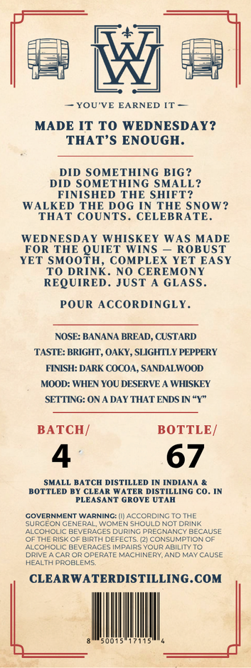
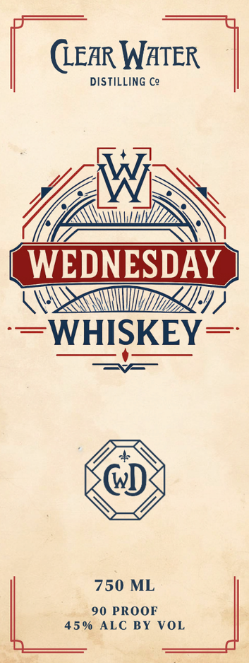

# TTB COLA Label Images - TTBID 26096001000898

**Brand Name:** WEDNESDAY WHISKEY

**Issue Date:** 04/07/2026

**Origin Code:** 45

**Product Class/Type:** 140

**Source:** [TTB Public COLA Registry](https://ttbonline.gov/colasonline/viewColaDetails.do?action=publicFormDisplay&ttbid=26096001000898)

## Label Images

### Back Label

### Front Label

## Extracted Label Text

*Text extracted via OCR - may contain errors*

### Back Label

M
YOU'VE EARNED
MADE IT TO WEDNESDAY?
THAT'S ENOUGH.
DID SOMETHING BIG ?
DID SOMETHING SMALL?
FINISHED THE SHIFT
WALKED THE DOG IN THE SNOW?
THAT COUNTS
CELEBRATE.
WEDNESDAY WHISKEY WAS MADE
FOR THE QUIET WINS
ROBUST
YET SMOOTH, COMPLEX YET EASY
TO DRINK. NO CEREMONY
REQUIRED. JUST
A GLASS_
POUR ACCORDINGLY_
NOSE: BANANA BREAD, CUSTARD
TASTE: BRIGHT, OAKY, SLIGHTLY PEPPERY
FINISH: DARK COCOA, SANDALWOOD
MOOD: WHEN YOU DESERVE _
WHISKEY
SETTING: ONA DAY THAT ENDS IN "Y"
BATCH/
BOTTLE /
4
67
SMALL BATCH DISTILLED IN INDIANA &
BOTTLED BY CLEAR WATER DISTILLING Co _
PLEASANT GROVE UTAH
GOVERNMENT WARNINC: (J ACCORDING TO THE
SURGEON GENERAL WOMEN SHOULD NOT DRINK
ALCOHOLIC BEVERAGES DURING PREGNANCY BECAUSE
THE RISK OF
e
DEFECTS /2| CONSUMPTION OF
ALCOHOLIC BEVERAGES IMPAIRS YOUR ABILITY TO
DpiE
CAR OR OPERATE MACHINERY AND MAY CAUSE
HEALTA PROBLENS
CLEARWATERDISTILLING.COM

### Front Label

(lear WATER
OWI
Ys je INS
[ge
| WEDNESDAY }
WS)
or ela Slee

Giw
