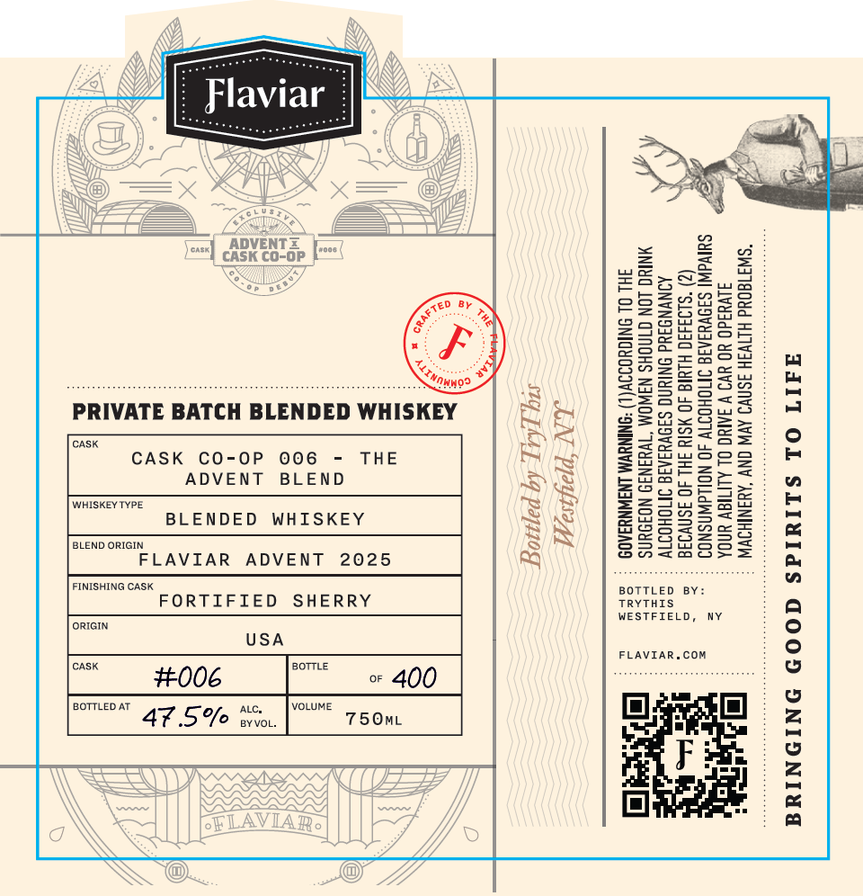

# TTB COLA Label Images - TTBID 26096001000951

**Brand Name:** FLAVIAR

**Fanciful Name:** PRIVATE BATCH BLENDED WHISKEY

**Issue Date:** 05/04/2026

**Origin Code:** 02

**Product Class/Type:** 137

**Source:** [TTB Public COLA Registry](https://ttbonline.gov/colasonline/viewColaDetails.do?action=publicFormDisplay&ttbid=26096001000951)

## Label Images

### Front Label

## Extracted Label Text

*Text extracted via OCR - may contain errors*

### Front Label

HdIT OL SLIYIMS GOOD ONIONIVGA

“SWITAOUd HLTV3H 3SNVD AV ONY ‘AYNTHOV
A1vUad0 YO YVO V IARC OL ALITIAY UNDA
SUIVW| S39VUIAIG INNOHOIT 40 NOLLAWNSNOO
(2) "5193430 HLUld 40 MSI 3HL 40 3SNVIIE
AINVNGIUd ONIUNG SI9VYIAIG IMIOHOTTV
YNRUG LON OTNOHS NAWOM “TVYINID NOIDUNS
HL OL SNIGYOIIV(L) “SNINYYM INWNUIADS

BOTTLED BY:
TRYTHIS
WESTFIELD, NY
FLAVIAR.COM

LN Peyayy
SU TAT, 44 POT

THE

atc,
ByvoL.

ADVENT BLEND
5%

BLENDED WHISKEY
FLAVIAR ADVENT 2025
FORTIFIED SHERRY

CASK CO-OP 006

PRIVATE BATCH BLENDED WHISKEY

a
47

WHISKEY TYPE.
BLEND ORIGIN,
FINISHING CASK
