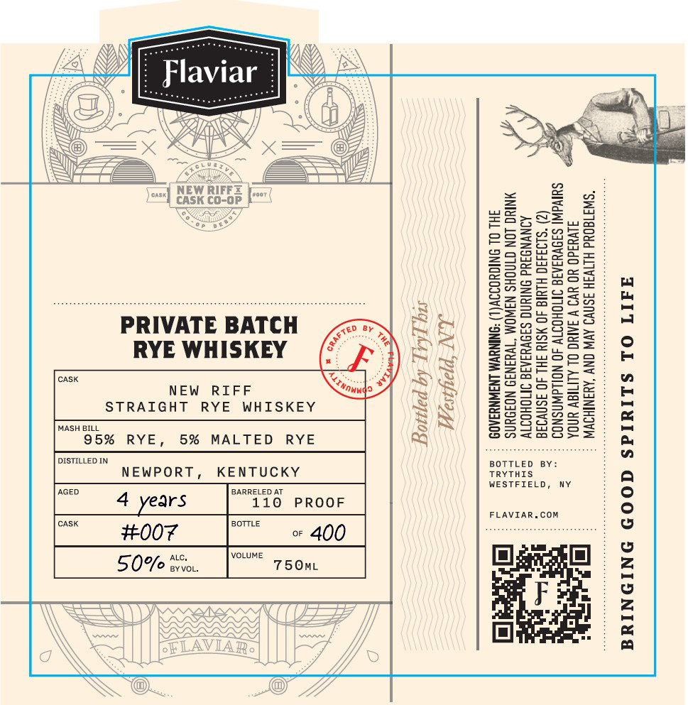

# TTB COLA Label Images - TTBID 26096001000952

**Brand Name:** FLAVIAR

**Fanciful Name:** PRIVATE BATCH RYE WHISKEY

**Issue Date:** 04/09/2026

**Origin Code:** 02

**Product Class/Type:** 102

**Source:** [TTB Public COLA Registry](https://ttbonline.gov/colasonline/viewColaDetails.do?action=publicFormDisplay&ttbid=26096001000952)

## Label Images

### Front Label

## Extracted Label Text

*Text extracted via OCR - may contain errors*

**Detected Proof:** 100
**Detected Age:** 4 Years

### Front Label

SA

N

[IN

oS

Flaviar

1 \

x)

\

GS}

}}

}}

w

.

ome

-\

p \

wa

SS

x

a

>

=

1G

Fi.

Ot

=)

NEW RIFF

(=

|

CASK CO-OP }'™

<8

#S>c=

3S

eSSs=afhbe

Ree

soon

226e05a

Z29a5

Bos

eo=

==

Hosea

SH2boes

Szqozracw

=5

Faasa

Su

Zouy=2=<=

PRIVATE BATCH

S24~92>

eaz

=

RYE WHISKEY

eZee

Zasa

SeSusoa

SS=

CASK

y

Goa

= le eee

NEW RIFF

)

Sa5-e

a=

>

=

250

S25

Q2=22

wea

STRAIGHT RYE WHISKEY

2a

Gos

MASH BILL

NY

Ss

ZSssz

S25c

95% RYE,

5% MALTED RYE

Sn=258

DISTILLED IN

sorrLen BY:

NEWPORT,

KENTUCKY

TRYTHIS

Ny

AGED

BARRELED AT

WESTFIELD,

10 PROOF

4 years

FLAVIAR.COM

cask

OTTLE

#007

» 400

Alc,

VOLUME

50%

ey VOL.

750mL

maz

Fi

7
