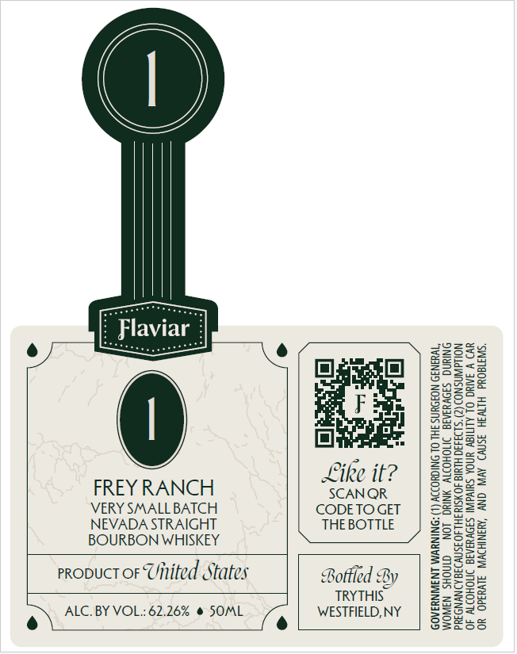

# TTB COLA Label Images - TTBID 26096001000954

**Brand Name:** FLAVIAR

**Fanciful Name:** VERY SMALL BATCH STRAIGHT BOURBON WHISKEY

**Issue Date:** 04/09/2026

**Origin Code:** 02

**Product Class/Type:** 101

**Source:** [TTB Public COLA Registry](https://ttbonline.gov/colasonline/viewColaDetails.do?action=publicFormDisplay&ttbid=26096001000954)

## Label Images

### Front Label

## Extracted Label Text

*Text extracted via OCR - may contain errors*

**Detected Proof:** 124.5

### Front Label

Like it?
FREY RANCH SCANOR
VERY SMALLBATCH CODETOGET
NEVADA STRAIGHT THE BOTTLE
BOURBON WHISKEY
propuct or Uitited States Bottled By
TRYTHIS”
WESTFIELD, NY

o> ALC. BY VOL.: 62.26% @ SOML

C)

(GES. DURING

») CONSUMPTION
TO DRIVE A CAR

, AND MAY CAUSE HEALTH PROBLEMS.

GOVERNMENT WARNING: (1) ACCORDING TO THE SURGEON GENERAL,

WOMEN SHOULD

SS
Se
gs

PREGNANCY BECAU:
