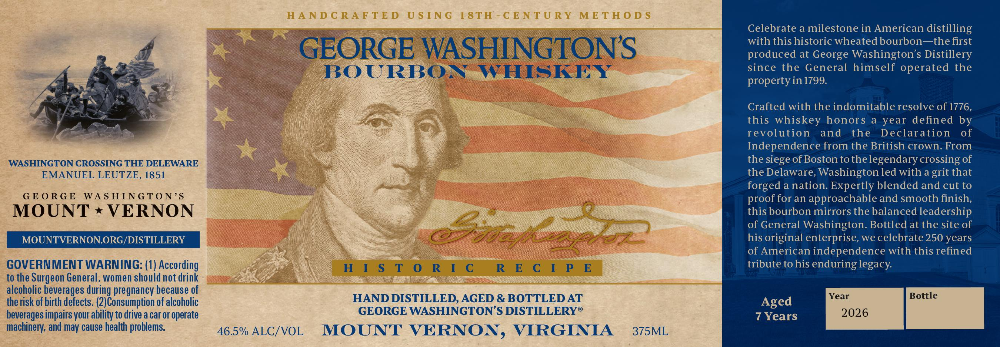
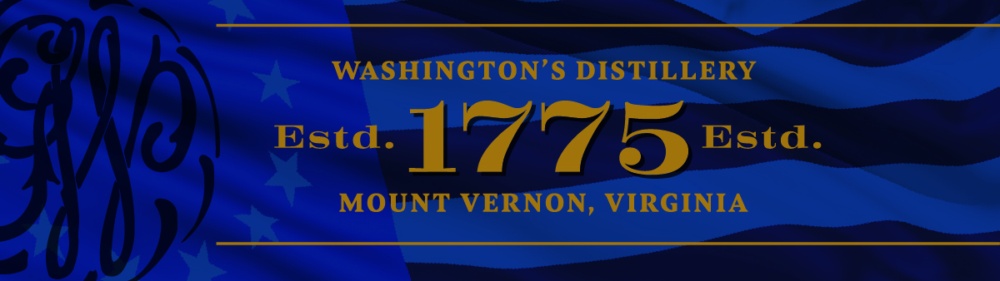

# TTB COLA Label Images - TTBID 26097001000095

**Brand Name:** GEORGE WASHINGTON'S

**Issue Date:** 04/13/2026

**Origin Code:** 05

**Product Class/Type:** 141

**Source:** [TTB Public COLA Registry](https://ttbonline.gov/colasonline/viewColaDetails.do?action=publicFormDisplay&ttbid=26097001000095)

## Label Images

### Label 1

### Label 2

## Extracted Label Text

*Text extracted via OCR - may contain errors*

*1 image(s) excluded: text did not meet readability threshold*

**Detected Proof:** 93
**Detected Age:** 7 Years

### Label 1

WASHINGTON CROSSING THE DELEWARE
EMANUEL LEUTZE, 1851

GEORGE WASHINGTON’S

MOUNT * VERNON

GOVERNMENT WARNING: (1) According
to the Surgeon General, women should not drink
alcoholic beverages during pregnancy because of
the tisk of birth defects. (2)Consumption of alcoholic
beverages impairs your ability to drive a car or operate
machinery, and may cause health problems.

GEORGE WASHINGTON'S

46.5% ALC/VOL

HISTORIC

BOURBON WHISKEY

HAND DISTILLED, AGED & BOTTLED AT
GEORGE WASHINGTON’S DISTILLERY®

MOUNT VERNON, VIRGINIA

RECIPE

375ML

Celebrate a milestone in American distilling
with this historic wheated bourbon—the first
produced at George Washington’s Distillery
since the General himself operated the
property in 1799.

Crafted with the indomitable resolve of 1776,
this whiskey honors a year defined by
revolution and the Declaration of
Independence from the British crown. From
the siege of Boston to the legendary crossing of
the Delaware, Washington led with a grit that
forged a nation. Expertly blended and cut to
proof for an approachable and smooth finish,
this bourbon mirrors the balanced leadership
of General Washington. Bottled at the site of
his original enterprise, we celebrate 250 years
of American independence with this refined
tribute to his enduring legacy.

Year Bottle

Aged
7 Years 2026
