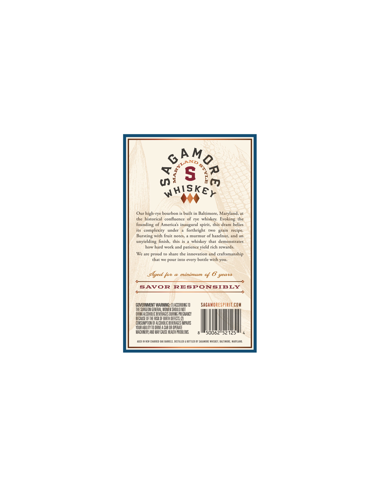
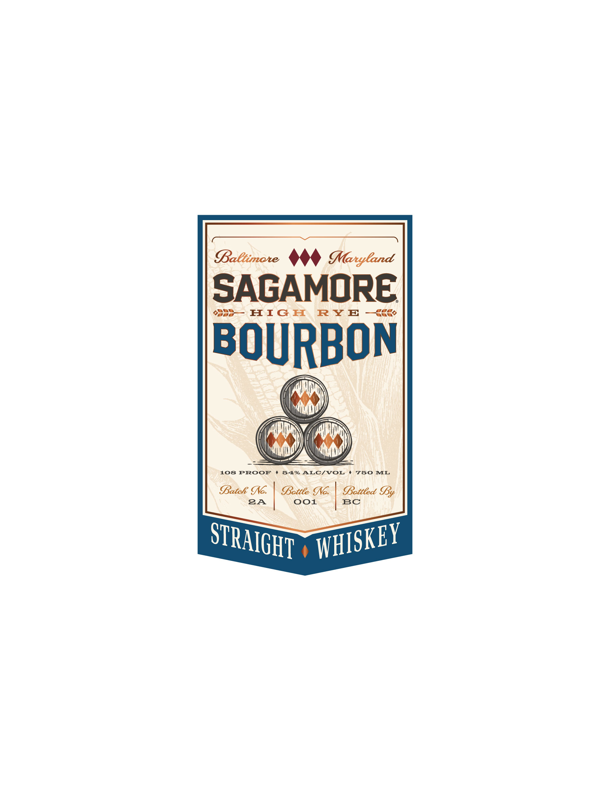

# TTB COLA Label Images - TTBID 26097001000127

**Brand Name:** SAGAMORE

**Fanciful Name:** HIGH RYE BOURBON

**Issue Date:** 04/08/2026

**Origin Code:** 25

**Product Class/Type:** 101

**Source:** [TTB Public COLA Registry](https://ttbonline.gov/colasonline/viewColaDetails.do?action=publicFormDisplay&ttbid=26097001000127)

## Label Images

### Back Label

### Front Label

## Extracted Label Text

*Text extracted via OCR - may contain errors*

**Detected Proof:** 108

### Back Label

Q {
S
0
Whiskey
Our high-rye bourbon is built in Baltimore, Maryland, at
the historical
confluence of rye   whiskey:
the
founding of Americas inaugural spirit, this dram belies
its   complexity
under
forthright
[WO
recipe:
Bursting with fruit notes,
murmur of hazelnut, and an
unyielding finish,  this
whiskey that demonstrates
how hard work and patience yield rich rewards
We are
proud to share the innovation and craftsmanship
that we pour into
bottle with you:
Sged fot
@ minimum
%
SAVOR
RESPONSIBLY
GOVERNMENT WARNING:
ACCORINGTO
SAGaMORESPRIt.COM
THE SURGEON GENERAL, WOMEN ShOuLD NOT
DFINK ALCOHOLIC BEVERAGES DURING PREGNANCY
BECAUSE OF THE HISK OF BIRTH DEFECTS
CONSUMPTHON OF ALCOHOLIC BEVERAGES IMPAIRS
YOUR ABILHTY TU DFIEA CAR OR OPEHATE
MACHINERK AND MAY CAUSE HEALTH PROBLEMS
50062152125
AGEd IN MEW CHARREd OAk Barrels. distilleD
BOttled BY SAGAMORE WHISKEY, BALTIMORE, MARYLAnd:
FmdR
9
SJLANS `
)
Evoking
grain
every
yeatd

### Front Label

BBaCtimote
Maryland
SAGAMORE
HIG H
RY E
BOURBON
108
PROOF
54%
ALC/VOL
750
ML
atck INc:
Bettee Io:
Sotteed By
2A
001
BC
STRAIGHT
WHISKEY
