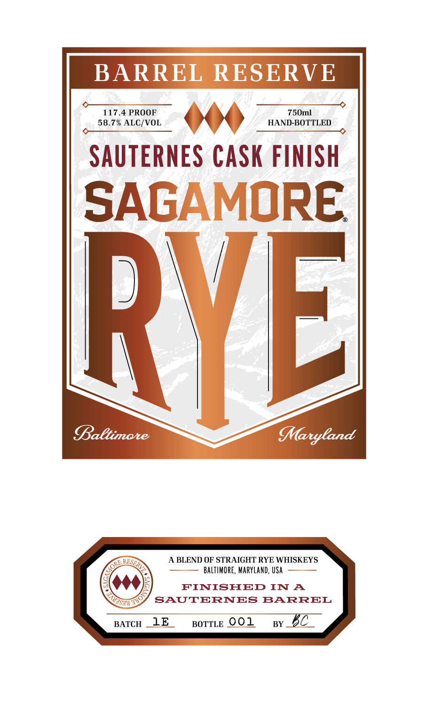
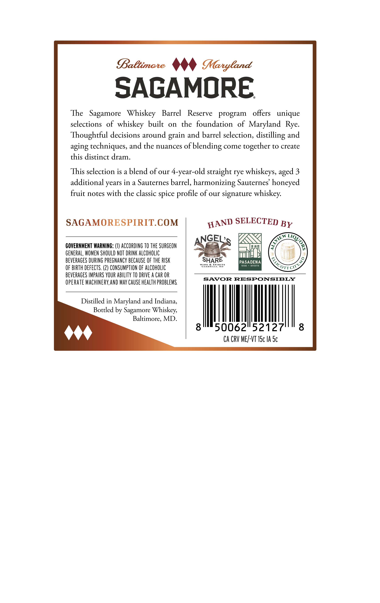

# TTB COLA Label Images - TTBID 26097001000133

**Brand Name:** SAGAMORE

**Fanciful Name:** BARREL RESERVE SAUTERNES CASK FINISH

**Issue Date:** 04/10/2026

**Origin Code:** 25

**Product Class/Type:** 122

**Source:** [TTB Public COLA Registry](https://ttbonline.gov/colasonline/viewColaDetails.do?action=publicFormDisplay&ttbid=26097001000133)

## Label Images

### Front Label

### Label 2

## Extracted Label Text

*Text extracted via OCR - may contain errors*

**Detected Proof:** 117.4

### Front Label

BARREL RESERVE

58.7% ALC/VOL.

117.4 PROOF

SAUTERNES CASK FINISH

SAGAMORE

y

Baltimore

A BLEND OF STRAIGHT RYE WHISKEYS

BALTIMORE, MARYLAND, USA

FINISHED IN A

NP

SAUTERNES BARREL

BaTcH _LE

BorTLe OOL

sy BC

### Label 2

SAGAMORE

The Sagamore Whiskey Barrel Reserve program offers unique

selections of whiskey built on the foundation of Maryland Rye.

Thoughtful decisions around grain and barrel selection, distilling and

aging techniques, and the nuances of blending come together to create

this distinct dram.

This selection is a blend of our 4-year-old straight rye whiskeys, aged 3

additional years in a Sauternes barrel, harmonizing Sauternes’ honeyed

fruit notes with the classic spice profile of our signature whiskey.

SAGAMORESPIRIT.COM

WAND SELECTED By

GEL:

q

GOVERNMENT WARNING: (1) ACCORDING TO THE SURGEON

IN

GENERAL, WOMEN SHOULD NOT DRINK ALCOHOLIC

mi

BEVERAGES DURING PREGNANCY BECAUSE OF THE RISK

WINE & SPIRIT!

GAMBRILLS, MD

SHARE

PASADENA

OF BIRTH DEFECTS. (2) CONSUMPTION OF ALCOHOLIC

COTTasS

BEVERAGES IMPAIRS YOUR ABILITY TO DRIVE A CAR OR

SAVOR RESPONSIBLY

OPERATE MACHINERY, AND MAY CAUSE HEALTH PROBLEMS.

Distilled in Maryland and Indiana,

Bottled by Sagamore Whiskey,

Baltimore, MD.

|

50062°52127

444

CA CRV ME/-VT 15c 1A 5c
