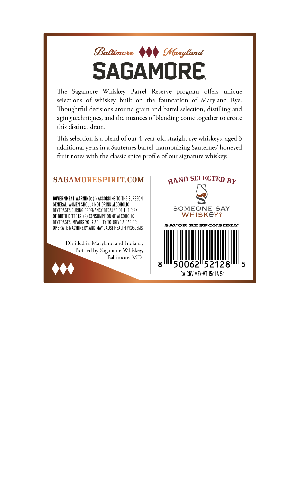
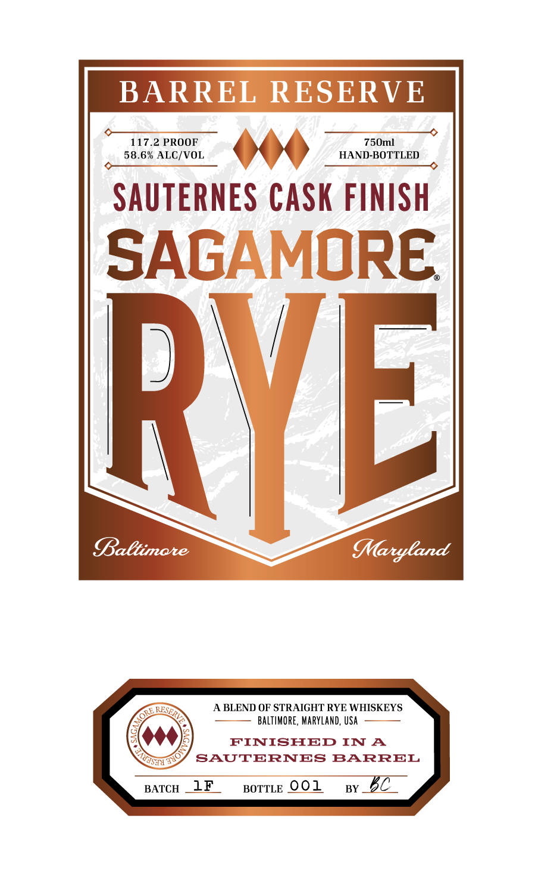

# TTB COLA Label Images - TTBID 26097001000137

**Brand Name:** BARREL RESERVE SAUTERNES CASK  FINISH

**Issue Date:** 04/09/2026

**Origin Code:** 25

**Product Class/Type:** 122

**Source:** [TTB Public COLA Registry](https://ttbonline.gov/colasonline/viewColaDetails.do?action=publicFormDisplay&ttbid=26097001000137)

## Label Images

### Back Label

### Front Label

## Extracted Label Text

*Text extracted via OCR - may contain errors*

**Detected Proof:** 117.2

### Back Label

SAGAMORE.

The Sagamore Whiskey Barrel Reserve program offers unique
selections of whiskey built on the foundation of Maryland Rye.
Thoughtful decisions around grain and barrel selection, distilling and
aging techniques, and the nuances of blending come together to create
this distinct dram.

This selection is a blend of our 4-year-old straight rye whiskeys, aged 3
additional years in a Sauternes barrel, harmonizing Sauternes’ honeyed
fruit notes with the classic spice profile of our signature whiskey.

SAGAMORESPIRIT.COM WAND SELECTED py

wa)

GOVERNMENT WARNING: (1) ACCORDING TO THE SURGEON
GENERAL, WOMEN SHOULD NOT DRINK ALCOHOLIC
BEVERAGES DURING PREGNANCY BECAUSE OF THE RISK SOMEONE SAY
OF BIRTH DEFECTS. (2) CONSUNPTION OF ALCOHOLIC WHISKEY?
BEVERAGES IMPAIRS YOUR ABILITY TO DRIVE A CAR OR
OPERATE MACHINERY, ND MAY CAUSE HEALTH PROBLEMS.

SAVOR RESPONSIBLY

Distilled in Maryland and Indiana,
Bottled by Sagamore Whiskey,
Baltimore, MD.

g050062°52128™ 5
CA CRY ME/-VT I5c IA Se

### Front Label

BARREL RESERVE

58.6% ALC/VOL.

117.2 PROOF

SAUTERNES CASK FINISH

SAGAMORE

y

Baltimore

A BLEND OF STRAIGHT RYE WHISKEYS

BALTIMORE, MARYLAND, USA

FINISHED IN A

NP

SAUTERNES BARREL

BATCH _LF

BorTLe OOL

sy BC
