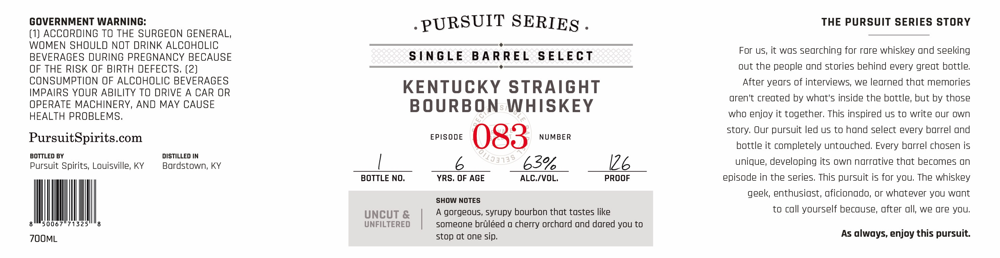

# TTB COLA Label Images - TTBID 26097001000185

**Brand Name:** PURSUIT SERIES

**Fanciful Name:** EPISODE 083

**Issue Date:** 04/08/2026

**Origin Code:** 22

**Product Class/Type:** 101

**Source:** [TTB Public COLA Registry](https://ttbonline.gov/colasonline/viewColaDetails.do?action=publicFormDisplay&ttbid=26097001000185)

## Label Images

### Label 1

### Label 2

## Extracted Label Text

*Text extracted via OCR - may contain errors*

**Detected Proof:** 126

### Label 1

GOVERNMENT WARNING:
PURSUIT SERIES
THE PURSUIT SERIES STORY
(1) ACCORDING TO THE SURGEON GENERAL,
WOMEN SHOULD NOT DRINK ALCOHOLIC
For US, it was searching for rare whiskey and seeking
BEVERAGES DURING PREGNANCY BECAUSE
S|NGLE
B A RREL
SELECT
OF THE RISK OF BIRTH DEFECTS, (2)
out the people ond stories behind every great bottle;
CONSUMPTION OF ALCOHOLIC BEVERAGES
After years of interviews; we learned that memories
IMPAIRS YOUR ABILITY TO DRIVE A CAR OR
KENTUCKY
STRAIGHT
aren't created by what's inside the bottle; but by those
OPERATE MACHINERY, AND MAY CAUSE
BOURBONWHISKEY
HEALTH PROBLEMS,
who enjoy it together; This inspired us to write our own
story Our pursuit led us to hand select every barrel ond
PursuitSpirits com
EPISODE
083
NUMBER
bottle it completely untouched; Every barrel chosen is
BOTTLED BY
DISTILLED IN
Pursuit Spirits; Louisville, KY
Bardstown; KY
63%
I26
unique; developing its own narrative that becomes n
BOTTLE NO_
YRS, OF AGE
ALC /VOL.
PROOF
episode in the series This pursuit is for you; The whiskey
geek,; enthusiast; aficionado; or whatever you want
SHOW NOTES
UNCUT &
A gorgeous, syrupy bourbon that tastes like
to coll yourself becouse; after ull; we re you;
50067"71325
UNFILTERED
someone brdleed
cherry orchard ond dored you to
ZOOML
stop at one sip,
As always, enjoy this pursuit
7/13313

### Label 2

COLE;
Lu
RL
OPwnsuit  enies
0
RYAN CECIL
SINGLE BARREL
276
1
KENNY COLEMAN
MAN
3
1
Pursuij
