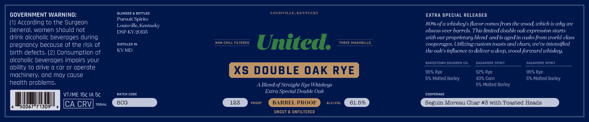
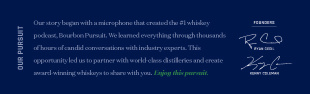

# TTB COLA Label Images - TTBID 26097001000206

**Brand Name:** UNITED

**Issue Date:** 04/08/2026

**Origin Code:** 22

**Product Class/Type:** 122

**Source:** [TTB Public COLA Registry](https://ttbonline.gov/colasonline/viewColaDetails.do?action=publicFormDisplay&ttbid=26097001000206)

## Label Images

### Back Label

### Label 2

## Extracted Label Text

*Text extracted via OCR - may contain errors*

**Detected Proof:** 133

### Back Label

bllenmed
bontlen
LOVISTILLI
KEKTUCK
GOVERNMENT WARNING:
EXTRA SPECIAL RELEASES
Pur suit Spirits
According to the Surgeon
Louisville Kentucky
80% of a whiskey s flavor comes from the wood,which is why we
General; women should not
DSP KY-20135
obsess over barrels This limited double oakexpression starts
drink alcoholic beveroges during
with our proprietary blend andis agedin casks from world-elass
pregnoncy becouse of the risk of
DISTILLED IN
Non chill FilterED
United:
THREE HAShBILLS
cooperages: Utilizing custom toasts and ehars; we've intensified
birth defects; (2) Consumption of
KY-MD
the oak s influence t0 deliver
deep.wood-forward whiskey:
alcoholic beveroges impoirs your
JepmsTO
Joucbokcd
GLGavopEpIPIT
GLGevOpEepiPM
ability to drive 0 cor 0r operote
XS DOUBLE OAK RYE
9590 Rye
5292 Rye
9596 Rye
mochinery, ond moy couse
536 Molted Borley
4390 Cor
592 Molted Borley
hedlth problems
Blend of Straight Rye Whiskeys
592 Molted Borley
Fatch
Lome
Extra Speeial Double Oak
compepcce
VTIME 15C IA 5c
CA CRV
7o0mL
8CG
133
PROOF
BARREL PROOF
ALC OL
61.595
Seguin Morcau Char #3 with Toasted Heads
50067"7 1309
UNCUT
UNFILTERED

### Label 2

Our story began with =
microphone that createdthe #I whiskey
Fimyneis
podeast, Bourbon Pursuit: Welearned everything through thousands
AQ
[
ofhours ofcandid conversations with industry experts This
Fantatn
8
opportunity ledusto partner with world-class distilleriesand create
26
award-winning whiskeysto share withyou. Enjoy this pursuit
KENk CCLYAN
