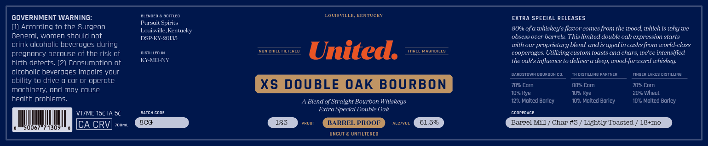
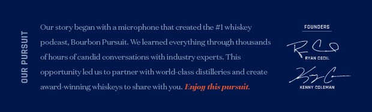

# TTB COLA Label Images - TTBID 26097001000214

**Brand Name:** UNITED

**Issue Date:** 04/08/2026

**Origin Code:** 22

**Product Class/Type:** 121

**Source:** [TTB Public COLA Registry](https://ttbonline.gov/colasonline/viewColaDetails.do?action=publicFormDisplay&ttbid=26097001000214)

## Label Images

### Back Label

### Label 2

## Extracted Label Text

*Text extracted via OCR - may contain errors*

**Detected Proof:** 133

### Back Label

bllenmed
bontlen
LOVISTILLI
KEKTUCK
GOVERNMENT WARNING:
EXTRA SPECIAL RELEASES
Pur suit Spirits
According to the Surgeon
Louisville Kentucky
80% of a whiskey s flavor comes from the wood,which is why we
General; women should not
DSP KY-20135
obsess over barrels This limited double oakexpression starts
drink alcoholic beveroges during
with our proprietary blend andis agedin casks from world-elass
pregnoncy becouse of the risk of
distiLLed IN
Non chill FilterED
United:
THREE HAShBILLS
cooperages: Utilizing custom toasts and ehars; we've intensified
birth defects; (2) Consumption of
KY-MD-NY
the oak s influence t0 deliver
deep; wood-forurd wniskey:
alcoholic beveroges impoirs your
Ramem
Joebokco
WistiG PaPTNER
Finger LaKES dISTILLING
ability to drive 0 cor 0r operote
XS DOUBLE OAK
BOURBON
7892 Corn
8032 Corn
709 Corn
mochinery, ond moy couse
109 Rye
1096 Rye
2016 Whedt
hedlth problems
Blend of' Straight Bourbon Whiskeys
1226 Molted Barley
1096 Molted Barley
10%6 Molted Barley
Fatch
Lome
Extra Speeial Double Oak
compepcce
VTIME 15C IA 5c
CA CRV
7o0mL
8CG
133
PROOF
BARREL PROOF
ALC VOL
61.595
Barrel Mill
Char #3
Lightly Toasted
18+n0
50067"7 1309
UNCUT
UNFILTERED

### Label 2

Our story began with a microphone that ereated the #1 whiskey

rounoens

podeast, Bourbon Pursuit. We learned everything through thousands

of hours of eandid conversations with industry experts, This

opportunity led us to partner with world-class distilleries and create

ue

eww ooinean

award-winning whiskeys to share with you. Enjoy ¢his pursuit.
