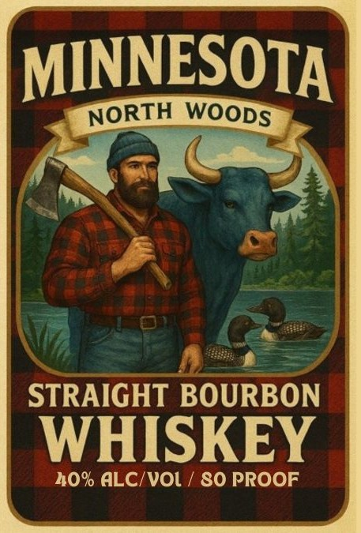

# TTB COLA Label Images - TTBID 26097001000229

**Brand Name:** MINNESOTA

**Issue Date:** 04/13/2026

**Origin Code:** 42

**Product Class/Type:** 101

**Source:** [TTB Public COLA Registry](https://ttbonline.gov/colasonline/viewColaDetails.do?action=publicFormDisplay&ttbid=26097001000229)

## Label Images

### Back Label

### Label 1

## Extracted Label Text

*Text extracted via OCR - may contain errors*

**Detected Proof:** 80
**Detected Age:** 2 Years

### Back Label

GOVERNMENT WARNING:
(1) ACCORDING TO THE SURGEON GENERAL, WOMEN
SHOULD NOT DRINK ALCOHOLIC BEVERAGES DURING
PREGNANCY BECAUSE OF THE RISK OF BIRTH DEFECTS.
(2) CONSUMPTION OF ALCOHOLIC BEVERAGES IMPAIRS
YOUR ABILITY TO DRIVE A CAR OR OPERATE MACHINERY,
AND MAY CAUSE HEALTH PROBLEMS.
750 ML
AGED
A MINIMUM 2 YEARS
DISTILLED IN WISCONSIN
PRODUCED BY BLACKFORK SPIRITS, LLC -
BRANDT, SOUTH DAKOTA
W
SD
8
97696
MN

### Label 1

MINNESOTA
STRAIGHT BOURBON
WHISKEY
40% ALCIVOl
80 PROOF
NORTH
WOODS
