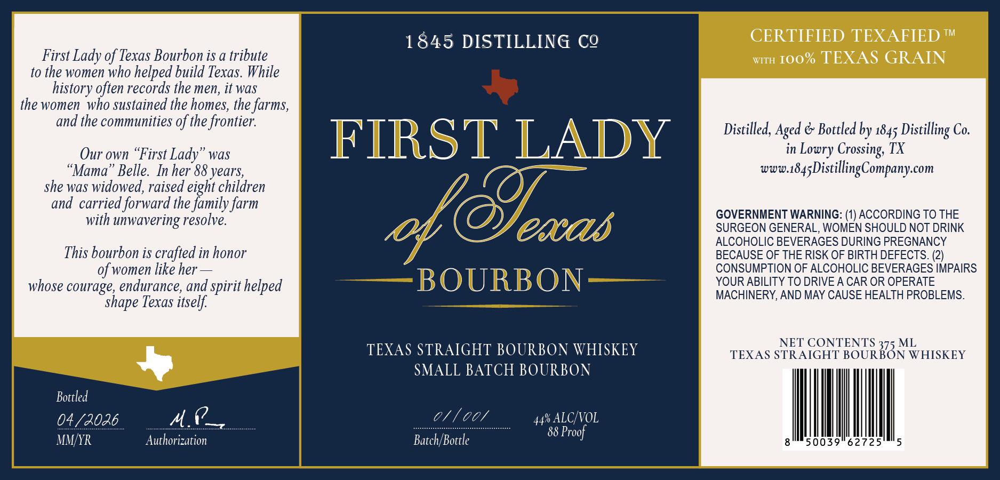

# TTB COLA Label Images - TTBID 26097001000297

**Brand Name:** FIRST LADY OF TEXAS

**Issue Date:** 04/08/2026

**Origin Code:** 44

**Product Class/Type:** 101

**Source:** [TTB Public COLA Registry](https://ttbonline.gov/colasonline/viewColaDetails.do?action=publicFormDisplay&ttbid=26097001000297)

## Label Images

### Label 1

## Extracted Label Text

*Text extracted via OCR - may contain errors*

**Detected Proof:** 88

### Label 1

1845 DISTILLING CQ
CERTIFIED TEXAFIED TM
First Lady of Texas Bourbon is a tribute
WITH
Ioo% TEXAS GRAIN
to the women who helped build Texas. While
history often records the men, it was_
the women who sustained the homes, the farms,
and the communities of the frontier:
Distilled, Aged
Bottled by 1845
Co.
Our own
'First Lady'
waS
FIRST LADY
in
Crossing; TX
Mama
Belle. In her 88 years;
www.1845 DistillingCompany com
she was widowed, raised eight children
and carried forward the family farm
with unwavering resolve.
c@9eacas
GOVERNMENT WARNING: (1) ACCORDING TO THE
SURGEON GENERAL, WOMEN SHOULD NOT DRINK
ALCOHOLIC BEVERAGES DURING PREGNANCY
This bourbon is crafted in honor
BECAUSE OF THE RISK OF BIRTH DEFECTS. (2)
of women like her
CONSUMPTION OF ALCOHOLIC BEVERAGES IMPAIRS
whose courage; endurance, and spirit helped
BOURBON
YOUR ABILITY TO DRIVE A CAR OR OPERATE
MACHINERY,AND MAY CAUSE HEALTH PROBLEMS_
Texas itself
NET CONTENTS 375 ML
TEXAS STRAIGHT BOURBON WHISKEY
TEXAS STRAIGHT BOURBON WHISKEY
SMALL BATCH BOURBON
Bottled
04/3036
M.Q=
44%
ALCHVOL
88 Proof
MMfyR
Authorization
Batch/Bottle
50039
62725
Distilling "
Lowry'
shape
