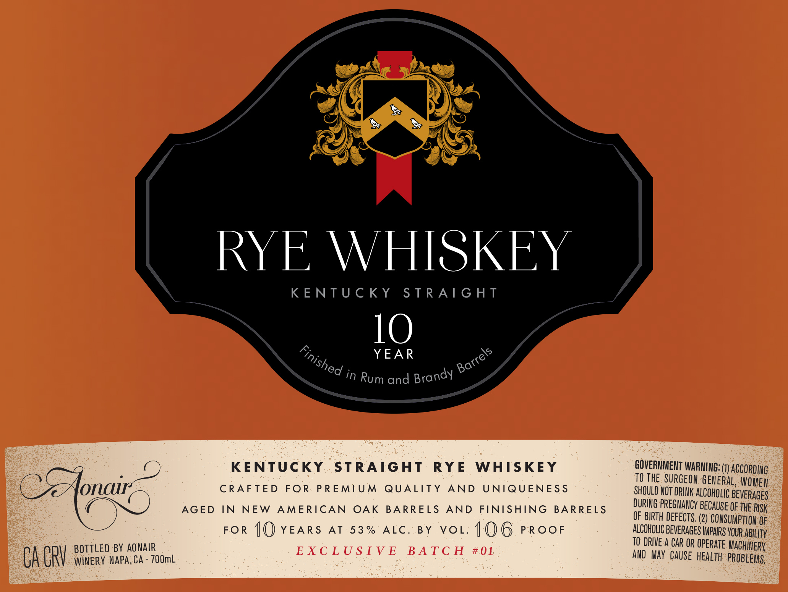

# TTB COLA Label Images - TTBID 26097001000307

**Brand Name:** AONAIR

**Issue Date:** 04/09/2026

**Origin Code:** 01

**Product Class/Type:** 102

**Source:** [TTB Public COLA Registry](https://ttbonline.gov/colasonline/viewColaDetails.do?action=publicFormDisplay&ttbid=26097001000307)

## Label Images

### Label 1

## Extracted Label Text

*Text extracted via OCR - may contain errors*

**Detected Proof:** 106

### Label 1

CACY

BOTTLED BY AONAIR
WINERY NAPA, CA - 700mL

RYE WHISKEY

KENTUCKY STRAIGHT

1O

YEAR &

&
“sf '
°o in Rum and Brandy ¥

KENTUCKY STRAIGHT RYE WHISKEY
CRAFTED FOR PREMIUM QUALITY AND UNIQUENESS
AGED IN NEW AMERICAN OAK BARRELS AND FINISHING BARRELS
FOR {Q YEARS AT 53% ALC. BY VOL. 1()6 PROOF
EXCLUSIVE BATCH #01

GOVERNMENT WARNING: (1) Acco! :
TO THE SURGEON BEVEMAL WOMEH :
SHOULD NOT DRINK ALCOHOLIC BEVERAGES
DURING PREGNANCY BECAUSE OF THE RISK
OF BIRTH DEFECTS. (2) CONSUMPTION 9

ALCOHOLIC BEVERAGES IMPAIRS YOUR ABILITY
TO DRIVE A CAR OR OPERATE MACHINERY
AND MAY CAUSE HEALTH PROBLEMS.
