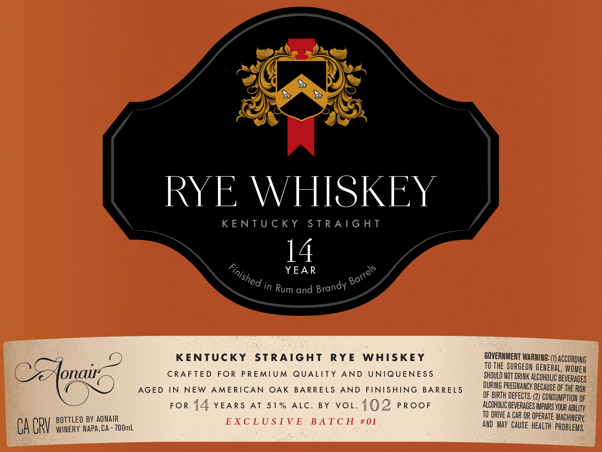

# TTB COLA Label Images - TTBID 26097001000318

**Brand Name:** AONAIR

**Issue Date:** 04/08/2026

**Origin Code:** 01

**Product Class/Type:** 102

**Source:** [TTB Public COLA Registry](https://ttbonline.gov/colasonline/viewColaDetails.do?action=publicFormDisplay&ttbid=26097001000318)

## Label Images

### Label 1

## Extracted Label Text

*Text extracted via OCR - may contain errors*

**Detected Proof:** 102
**Detected Age:** 14 Years

### Label 1

RYE WHISKEY

KENTUCKY STRAIGHT

14

YEAR &

&
Usp Oo
°d in Rum and Brandy ¥

KENTUCKY STRAIGHT RYE WHISKEY

CRAFTED FOR PREMIUM QUALITY AND UNIQUENESS
AGED IN NEW AMERICAN OAK BARRELS AND FINISHING BARRELS
FOR {4 YEARS AT 51% ALC. BY VOL. 1 ()2D PROOF
BOTTLED BY AONAIR EXCLUSIVE BATCH #401

: CA CRY WINERY NAPA, CA - 700mL

GOVERNMENT WARNING: (1) Aco

TO THE SURGEON CeIERAL WUE
SHOULD NOT DRINK ALCOHOLIC BEVERAGES
DURING PREGNANCY BECAUSE OF THE RISK
OF BIRTH DEFECTS, (2)

ALCOHOLIC BEVERAGES IMPQRS YOUR ABILITY

TO DRIVE A CAR OR OPERATE MACHINERY
AND MAY CAUSE HEALTH PROBLEMS
