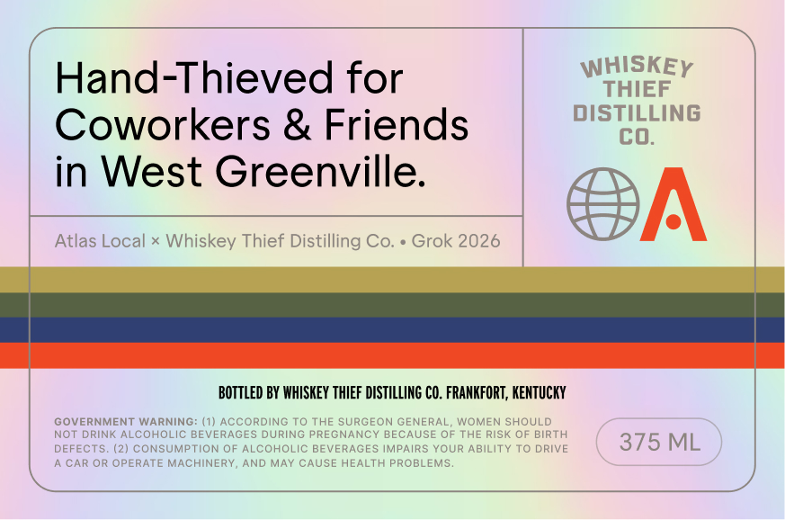

# TTB COLA Label Images - TTBID 26097001000365

**Brand Name:** WHISKEY THIEF DISTILLING CO.

**Issue Date:** 04/08/2026

**Origin Code:** 22

**Product Class/Type:** 101

**Source:** [TTB Public COLA Registry](https://ttbonline.gov/colasonline/viewColaDetails.do?action=publicFormDisplay&ttbid=26097001000365)

## Label Images

### Back Label

## Extracted Label Text

*Text extracted via OCR - may contain errors*

### Back Label

Hand-Thieved for
WHHSEEY
diSTILLING
Coworkers & Friends
cO.
in West Greenville.
Atlas Local x Whiskey Thief Distilling Co.
Grok 2026
BOTTLED BY WhISKEY THIEF DISTILLING CO. FRANKFORT, KENTUCKY
GOVERNMENT WARNING: (1) ACcORDING To THE SURGEON GENERAL;
WOMEN SHOULD
NOT DRINK ALCOHOLIC BEVERAGES DURING PRECNANCY BECAUSE OF THE RISK OF BIRTH
DEFECTS.
(2) CONSUMPTION OF ALCOHOLIC BEVERAGES IMPAIRS YOUR ABILITY TO DRIVE
375 ML
CAR OR OPERATE MACHINERY , AND MAY CAUSE HEALTH PROBLEMS
