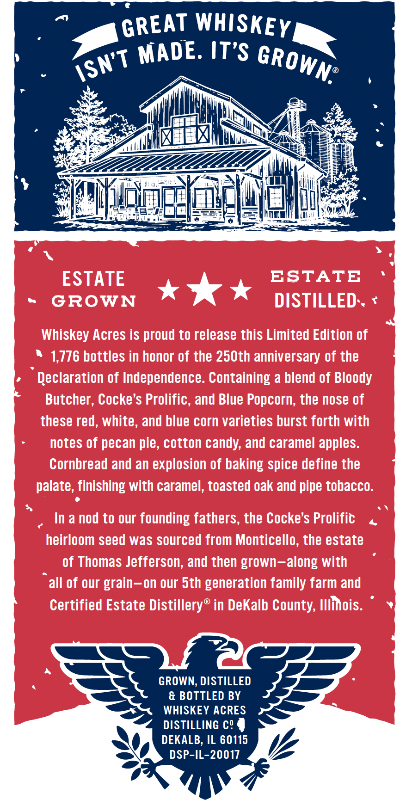
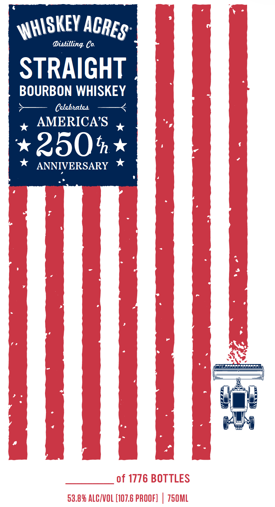
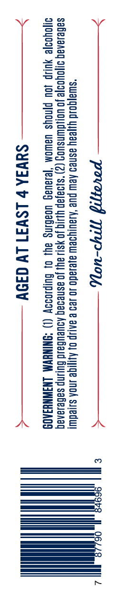

# TTB COLA Label Images - TTBID 26097001000401

**Brand Name:** WHISKEY ACRES DISTILLING CO.

**Issue Date:** 04/09/2026

**Origin Code:** 04

**Product Class/Type:** 101

**Source:** [TTB Public COLA Registry](https://ttbonline.gov/colasonline/viewColaDetails.do?action=publicFormDisplay&ttbid=26097001000401)

## Label Images

### Back Label

### Front Label

### Label 2

### Label 4

## Extracted Label Text

*Text extracted via OCR - may contain errors*

**Detected Proof:** 107.6

### Back Label

WHISKEY
It'S
ESTATE
ESTATE
GROWN
DISTILLED.
Whiskey Acres is proud to release this Limited Edition of
1,776 bottles in honor of the 250th anniversary of the
Declaration of Independence. Containing a blend of Bloody
Butcher, Cocke's Prolific, and Blue Popcorn, the nose of
these red, white, and blue corn varieties burst forth with
notes of pecan pie, cotton candy; and caramel apples:
Cornbread and an explosion of baking spice define the
palate, finishing with caramel, toasted oak and pipe tobacco:
In a nod to our founding fathers, the Cocke's Prolific
heirloom seed was sourced from Monticello, the estate
of Thomas Jefferson; and then grown-along with
all of our grain-on our Sth generation family farm and
Certified Estate Distillerys
in DeKalb County; Illinois.
GROWN, DISTILLED
& BOTTLED BY
WHISKEY ACRES
DISTILLING c' =
DEKALB, IL 60115
DSP-IL-20017
GREAT
MADE:
GROWN?
iSN'T

### Front Label

Distilling Co
STRAIGHT
BOURBON WHISKEY
Celebhatea
AMERICAS
250t
ANNIVERSARY
of 1776 BOTTLES
53.89 ALCIVOL [107.6 PROOF]
750ML
WHISKEY _
ACRES"

### Label 2

For tours and

tastings vist

Whisheydcres.com

### Label 4

>———— povarng 1p-uey, —————<

“swua]qoud yyjeay asneo Aew pue ‘AaulyoeW ajesado J0 129 & AAUP Of AGE INA swedUUI
saBelanag o1joyooye JO Uolsdwnsuog (2) "siaajap Ylsiq JO YS ay Jo asnedag AUEUBald Bulnp sabelanaq
Syoyoo}e YUP JOU Pinoys WawoM ‘Je1auag UOaHiNg ay) 0} BUIpIODDy (1) “ONINHYM LNIWNHIAOS

>————— Saw b LSV37 Ly a35¥ ———————-<

HHT
