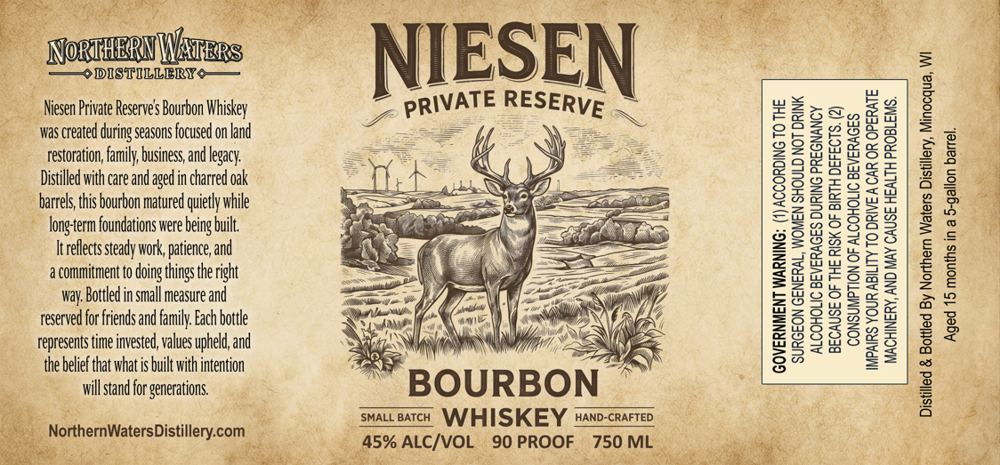

# TTB COLA Label Images - TTBID 26097001000471

**Brand Name:** NIESEN PRIVATE RESERVE

**Issue Date:** 04/08/2026

**Origin Code:** 48

**Product Class/Type:** 141

**Source:** [TTB Public COLA Registry](https://ttbonline.gov/colasonline/viewColaDetails.do?action=publicFormDisplay&ttbid=26097001000471)

## Label Images

### Label 1

## Extracted Label Text

*Text extracted via OCR - may contain errors*

### Label 1

Private Reserve's Bourbon Whiskey
Was created during seasons focused on land
restoration, family, business, and legacy.
Distilled with care and aged in charred oak
‘barrels, this bourbon matured quietly while

long-term foundations were being built.
Itreflects steady work, patience, and

a commitment to doing things the right

way. Bottled in small measure and
reserved for friends and family. Each bottle

Tepresents time invested, values upheld, and
the belief that what is built with intention

will stand for generations.

jernWatersDistillery.com
y ‘1

: (1) ACCORDING TO THE

SURGEON GENERAL, WOMEN SHOULD NOT DRINK

ALCOHOLIC BEVERAGES DURING PREGNANCY
BECAUSE OF THE RISK OF BIRTH DEFECTS. (2)
CONSUMPTION OF ALCOHOLIC BEVERAGES
IMPAIRS YOUR ABILITY TO DRIVE A CAR OR OPERATE

2
2
=
=
=
5
a
2
2
a
3
8

MACHINERY, AND MAY CAUSE HEALTH PROBLEMS.
d & Bottled By Northern Waters Distillery, Minocqua, WI
