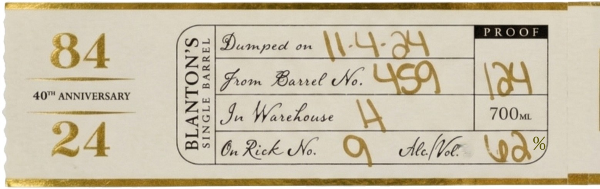

# TTB COLA Label Images - TTBID 26097001000490

**Brand Name:** BLANTON'S

**Fanciful Name:** 40TH ANNIVERSARY

**Issue Date:** 04/09/2026

**Origin Code:** 00

**Product Class/Type:** 101

**Source:** [TTB Public COLA Registry](https://ttbonline.gov/colasonline/viewColaDetails.do?action=publicFormDisplay&ttbid=26097001000490)

## Label Images

### Back Label

### Label 2

## Extracted Label Text

*Text extracted via OCR - may contain errors*

*1 image(s) excluded: text did not meet readability threshold*

### Label 2

EXPORTED TO: UNTED KINGDOM
RE-IMPORTED BY: CONNOISSEUR WNES & SPIRITS CALIFORNIA NAPA, CA
OBTAINED FROM A PRIVATE COLLECTION"
GOVERNMENT WARNING: (1) ACCORDING TO THE SURGEON GENERAL, WOMEN SHOULD NOT
DRINK ALCOHOLIC BEVERAGES DURING PREGNANCY BECAUSE OF THE RISK OF BIRTH
DEFECTS. (2) CONSUMPTION OF ALCOHOLIC BEVERAGES IMPAIRS YOUR ABILITY TO DRIVE A
CAR OR OPERATE MACHINERY
AND MAY CAUSE HEALTH PROBLEMS_
