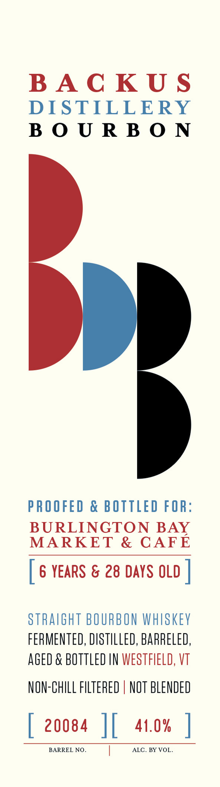

# TTB COLA Label Images - TTBID 26097001000643

**Brand Name:** BACKUS DISTILLERY, LLC

**Issue Date:** 04/09/2026

**Origin Code:** 46

**Product Class/Type:** 101

**Source:** [TTB Public COLA Registry](https://ttbonline.gov/colasonline/viewColaDetails.do?action=publicFormDisplay&ttbid=26097001000643)

## Label Images

### Back Label

### Front Label

## Extracted Label Text

*Text extracted via OCR - may contain errors*

*1 image(s) excluded: text did not meet readability threshold*

**Detected Age:** 6 Years

### Front Label

BACKUS
DISTILLERY
BOURBON
PROOFED & BOTTLED FOR:
BURLINGTON BAY
MARKET & CAFE
[ 6 YEARS & 28 DAYS OLD |
STRAIGHT BOURBON WHISKEY
FERMENTED, DISTILLED, BARRELED,
AGED & BOTTLED IN WESTFIELD, VT
NON-CHILL FLTERED | NOT BLENDED
[ 20084 |{ 41.0% |
