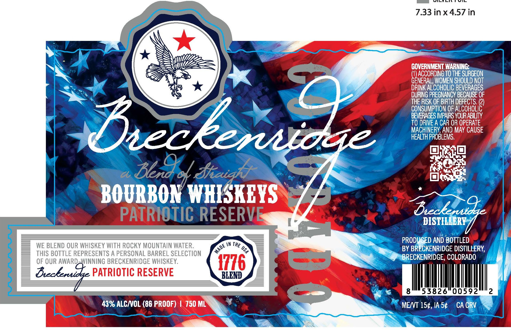

# TTB COLA Label Images - TTBID 26097001000913

**Brand Name:** BRECKENRIDGE DISTILLERY

**Fanciful Name:** PATRIOTIC RESERVE

**Issue Date:** 04/09/2026

**Origin Code:** 13

**Product Class/Type:** 121

**Source:** [TTB Public COLA Registry](https://ttbonline.gov/colasonline/viewColaDetails.do?action=publicFormDisplay&ttbid=26097001000913)

## Label Images

### Label 1

## Extracted Label Text

*Text extracted via OCR - may contain errors*

**Detected Proof:** 86

### Label 1

DciN
7.33 inx4.57 in
GOVERNMENT WARNING:
ACCORDING TO THE SURGEON
GEnezordOGeOT BeOurGeOT
DRINK ALCOHOLIC BEVERAGES
DURING PREGNANCY BECAUSE OF
THE RISK OF BIRTH DEFECTS (2)
CONSUMPTION OF ALCOHOLIC
BEVERAGES IMPAIRS YOURABILITY
TO DRIVE A CAR OR OPERATE
beekeraidge
FEACthPRoBLEN May Cause
Berd
draigkyf
BOURBON WHISKEYS
PATRIOTIC RESERVE
beckeuidge
DISTILLERY
PRODUCED AND BOTTLED
WE BLEND OUR WHISKEY WITH ROCKY MOUNTAIN WATER
IN THE
BY BRLCKENRIDGE DISTILLERY,
THIS BOTTLE REPRESENTS A PERSONAL BARREL SELECTION
BRECKENRIDGE, COLORADO
OF OUR AWARD-WINNING BRECKENRIDGE WHISKEY:
1776
=
Beceenidze PATRIOTIC RESERVE
BLEND
8
53826
00592
2
43% ALCNOL (86 PROOF)
750 ML
MENT 150, IA 50
CA CRV
MADE _
2
