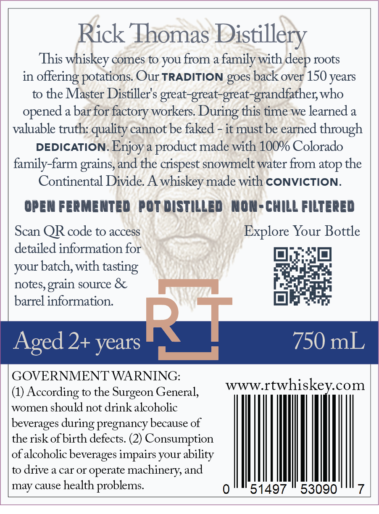
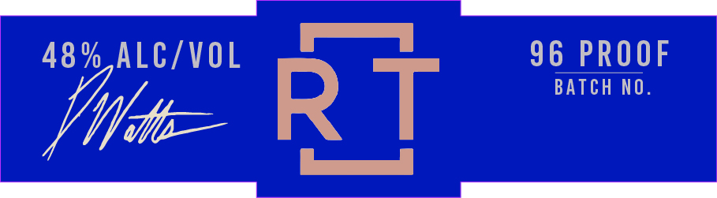

# TTB COLA Label Images - TTBID 26097001000916

**Brand Name:** RICK THOMAS

**Issue Date:** 04/09/2026

**Origin Code:** 13

**Product Class/Type:** 101

**Source:** [TTB Public COLA Registry](https://ttbonline.gov/colasonline/viewColaDetails.do?action=publicFormDisplay&ttbid=26097001000916)

## Label Images

### Back Label

### Front Label

## Extracted Label Text

*Text extracted via OCR - may contain errors*

*1 image(s) excluded: text did not meet readability threshold*

### Back Label

Rick Thomas Distillery
This whiskey comes to you from a family with
roots
in
offering potations Our TRADITION goes back over 150 years
to the Master Distiller's great-great-great-grandfather who
a bar for factory workers
this time we learned a
valuable truth: quality cannot be faked - it must be earned through
DEDICATION
product made with 100% Colorado
family-farm grains, and the crispest snowmelt water from atop the
Continental Divide. A whiskey made with CONVICTION:
OPEN FerMENted] pot distilled
NOM- chILL filtered
Scan QR code to access
Explore Your Bottle
detailed information for
your batch, with
notes, =
source &
barrel information.
Aged 2+ years
750 mL
GOVERNMENT WARNING:
(1)
According
to the
Surgeon General,
WWW rtwhiskey com
women should not drinkalcoholic
beverages
pregnancy because of
the risk ofbirth defects. (2) Consumption
of alcoholic beverages impairs your
to drive a car or
operate machinery, and
may cause health
problems:
51497
53090
deep
During
opened
Enjoy
tasting
grain
during -
ability
