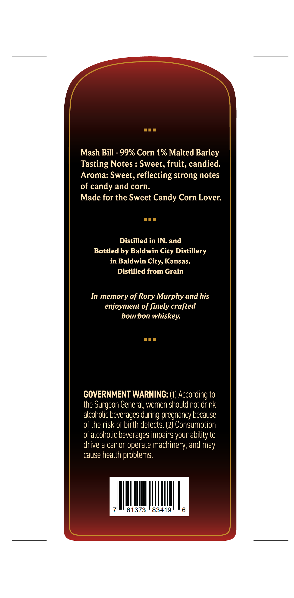
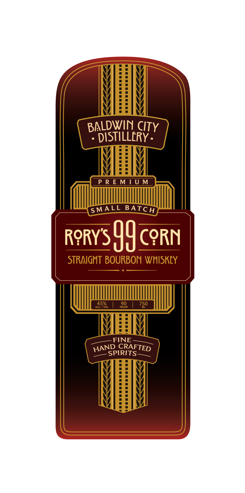

# TTB COLA Label Images - TTBID 26097001000919

**Brand Name:** BALDWIN CITY DISTILLERY

**Issue Date:** 04/09/2026

**Origin Code:** 21

**Product Class/Type:** 101

**Source:** [TTB Public COLA Registry](https://ttbonline.gov/colasonline/viewColaDetails.do?action=publicFormDisplay&ttbid=26097001000919)

## Label Images

### Back Label

### Front Label

## Extracted Label Text

*Text extracted via OCR - may contain errors*

### Back Label

ann

Mash Bill - 99% Corn 1% Malted Barley

Tasting Notes : Sweet, fruit, candied

Aroma: Sweet, reflecting strong notes

of candy and corn

Made for the Sweet Candy Corn Lover.

ann

Distilled in IN. and

Bottled by Baldwin City Distillery

in Baldwin City, Kansas

Distilled from Grain

In memory of Rory Murphy and his

enjoyment of finely crafted

bourbon whiskey.

ann

GOVERNMENT WARNING: (1) According to

the Surgeon General, women should not drink

alcoholic beverages during pregnancy because

of the risk of birth defects. (2) Consumption

f alcoholic beverages impairs your ability to

drive a car or operate machinery, and may

cause health problems

|

|

|

|,

|

61373

83419

### Front Label

WHA
VERY
MEW
VIBBIY
MLDWIN CI
WlEETY
VAN
ME
| PREMIUM |
OM
poRYS 44 CORN
STRAIGHT BOURBON WHISKEY
a
Wietly
MEN
VERY
YEA
MEA
VERY
