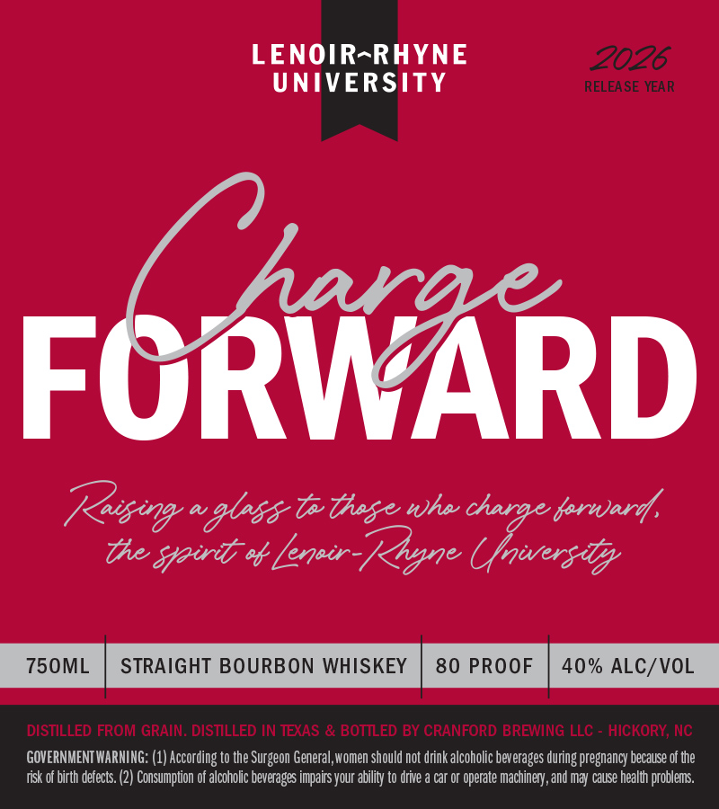

# TTB COLA Label Images - TTBID 26097001000954

**Brand Name:** CHARGE FORWARD

**Issue Date:** 04/17/2026

**Origin Code:** 35

**Product Class/Type:** 101

**Source:** [TTB Public COLA Registry](https://ttbonline.gov/colasonline/viewColaDetails.do?action=publicFormDisplay&ttbid=26097001000954)

## Label Images

### Label 1

## Extracted Label Text

*Text extracted via OCR - may contain errors*

**Detected Proof:** 80

### Label 1

LENOIR-RHYNE
2026
UNIVERSITY
RELEA SE YEAR
Uharae
FORWARD
Rasing aglns& Tthse whe=
fornard,
the spiri % _
Leneir-Kyne Uwersttyy
750ML
STRAIGHT BOURBON WHISKEY
80 PROOF
40% ALC/VOL
DISTILLED FROM GRAIN. DISTILLED IN TEXAS & BOTILED BY CRANFORD BREWING
HICKORY; Nc
GOVERNMENT WARHIHG: (1) According to the Surgeon General,women should not drink alcoholic beverages during pregnancy because of the
risk of birth defects. (2) Consumption of alcoholic beverages impairs your ability to drive
car Or
( operate machinery, and may cause health problems.
charae
LLC =
