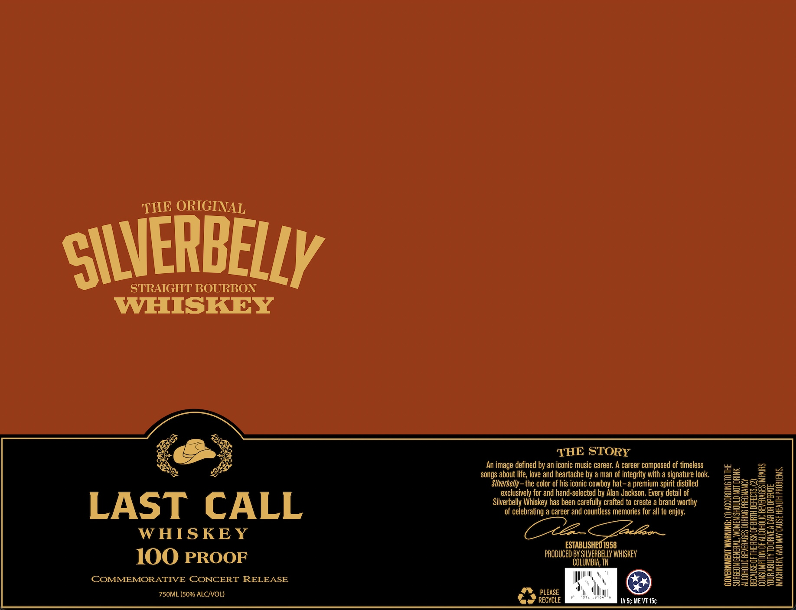

# TTB COLA Label Images - TTBID 26097001000971

**Brand Name:** SILVERBELLY WHISKEY

**Issue Date:** 04/09/2026

**Origin Code:** 43

**Product Class/Type:** 101

**Source:** [TTB Public COLA Registry](https://ttbonline.gov/colasonline/viewColaDetails.do?action=publicFormDisplay&ttbid=26097001000971)

## Label Images

### Label 1

### Label 2

## Extracted Label Text

*Text extracted via OCR - may contain errors*

*1 image(s) excluded: text did not meet readability threshold*

**Detected Proof:** 100

### Label 1

HE ORIGINAL

C\WERBEL/

STRAIGHT BOURBON

WHISKEY

LAST CALL

WHISKEY
100 PROOF

COMMEMORATIVE CONCERT RELEASE
750ML (50% ALC/VOL)

THE STORY

‘An image defined by an iconic music career. A career composed of timeless
songs about life, love and heartache by a man of integrity with a signature look.
Silverbelly-the color of his iconic cowboy hat-a premium spirit distilled
exclusively for and hand-selected by Alan Jackson. Every detail of
Silverbelly Whiskey has been carefully crafted to create a brand worthy
of celebrating a career and countless memories for all to enjoy.

Lacltoon

ESTABLISHED 1958
PRODUCED BY SILVERBELLY WHISKEY
COLUMBIA, TN

*) ILE EN i)
ae RECYCLE TA 5¢ ME VT 15¢

: (1) ACCORDING 10 THE

SURGEON GENERAL, WOMEN SHOULD NOT DRINK
ALCOHOLIC BEVERAGES DURING PREGNANCY

GOVERNMENT WARNING:

CONSUMPTION OF ALCOHOLIC BEVERAGES IMPAIRS

BECAUSE OF THE RISK OF BIRTH DEFECTS. (2)
YOUR ABILITY 10 DRIVE A CAR OR OPERATE

MACHINERY, AND MAY CAUSE HEALTH PROBLEMS,
