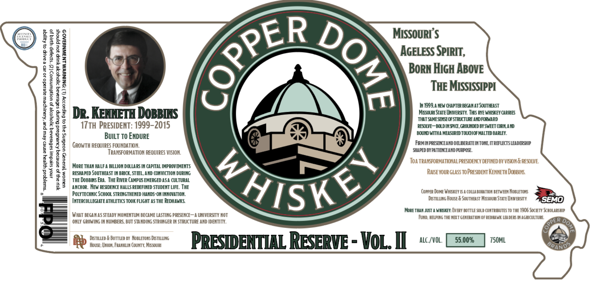

# TTB COLA Label Images - TTBID 26098001000076

**Brand Name:** COPPERDOME

**Issue Date:** 04/09/2026

**Origin Code:** 29

**Product Class/Type:** 140

**Source:** [TTB Public COLA Registry](https://ttbonline.gov/colasonline/viewColaDetails.do?action=publicFormDisplay&ttbid=26098001000076)

## Label Images

### Label 1

### Label 2

## Extracted Label Text

*Text extracted via OCR - may contain errors*

*1 image(s) excluded: text did not meet readability threshold*

### Label 1

1
MISSOURI $
1
H
AGELESS SPIRIT;,
BoRN HIGH ABOvE
1
1
THE MISSISSIPPI
3
L
1
H be Kennei Dosens
Hi999 STEV GVTESTE HHSTSGHESTYGRMB
1
THAT SAHESB LSE OF STRUCTURE AHDFORWARD
3
IZth PRESIDENT: 1999-2015
RESOLVE ~BOLD INPIG  GROUNDED BY SLEET CORMAHD
BOUHDWITHA HEASURED TOUCHOF MALTED BARLEY:
W
GROwTH REQUIRES
'Builtxo Ebdure
FRHIMPRESEKCEAND DEEERATE INTONE IT REFLECTSLEADESHIP
TRaNSFORMATION REOUIRES VISION;
SHAPED BYPATIEXEAND PURPOS
J
I
MoRE THAH HALF A BILLION DOLLA RS IH CAPITAL IMPROVEMENTS
Toa TRANSFORMATIONAL PRESIDENCY DEFINED BY VEION & RESOLVE
8
RESHA PED SouTHEAST IM BRICK, STEL.AND CONVICTIOH DURING
Rase YouR GLASS To PRESIDEnT Kenneth Dobbig
1
I
THE DOBB[NS ERa .  THE RIVER CAMPUS EMERGED ASA CULTURAL
Lsk /
0
ANCHOR. NEw RESDENCE HALLS REDEFINED STUDENT LIFE. THE
POLYTEcHNIc School STRENGTHENED HANDS-ON INNOVATIOH:
CoPPER Doxe WHEKey IS A COLLA BORATIOH BETWEEN NoBLETONS
INTERCOLLEGIAT E ATHLETICS TOOK FLIGHT AS THE REDHAWKS
Distlung House & SoUTHEASt Missou State UMweRSITY
8EMO
MORE THAX JuST A WHEKEY: EvERY BOTTLE SOLD CONTRIBUTES T0 THE 4906 SOcETy ScHOLARSHIP
What BEGA MAS STEADY MOMENTUM BECAME LASTING PRESENCE _
UNIVERSITY HOT
Fund;HELPING THE NEXT GENERAT [ON OF REDRAWK LEA dEE INAGRICULTURE
ONLY GROLING IK HUMBERS, BUT STA NDING STRONGER IK STRUCTURE AND IDENTITY.
Do
Distilled & BoTTLED BY  NOBLETONs DiSTILUNG
PRESTDENTIAL RESERVE
VoL_ II
alc /VOL;
55.009
750ML
House ; Unjon, Feakklm County, Mesouri
GRAnO?
CPPEA
;
1
2
SPPER
