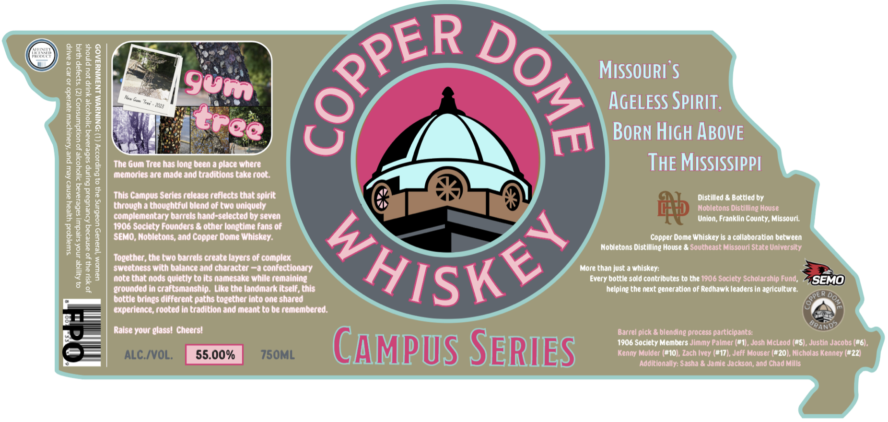

# TTB COLA Label Images - TTBID 26098001000078

**Brand Name:** COPPERDOME

**Issue Date:** 05/13/2026

**Origin Code:** 29

**Product Class/Type:** 140

**Source:** [TTB Public COLA Registry](https://ttbonline.gov/colasonline/viewColaDetails.do?action=publicFormDisplay&ttbid=26098001000078)

## Label Images

### Label 1

### Label 2

## Extracted Label Text

*Text extracted via OCR - may contain errors*

*1 image(s) excluded: text did not meet readability threshold*

### Label 1

gos

soo8

ER

ge5B

gee

MISSOURI'S

ras

Seam

S|

Bz

oss

2g

Io

3¢

a3

Os AGELESS SPIRIT,

$B

4

2

22

200

Q3

_

rm BORN HIGH ABOVE

252

g 3

a &

The Gum Tree has long been a place where

THE MISSISSIPPI

£3

memories are made and traditions take root.

8g

83

This Campus Series release reflects that spirit

Distilled & Bottied by

zo

through a thoughtful blend of two uniquely

Nobletons Distilling House

5 =

a8

complementary barrels hand-selected by seven

Union, Franklin County, Missouri.

Rae

1906 Society Founders & other longtime fans of

SEMO, Nobletons, and Copper Dome Whiskey.

Copper Dome Whiskey Is a collaboration between

383

Nobletons Distilling House & Southeast Missouri State University

Sas

Together, the two barrels create layers of complex

re

sweetness with balance and character —a confectionary

More than just a whiskey:

235

note that nods quietly to its namesake while remaining

Every bottle sold contributes to the 1906 Society Scholarship Fund,

%SEMO)

grounded in craftsmanship. Like the landmark itself, this

helping the next generation of Redhawk leaders in agriculture.

bottle brings different paths together into one shared

AVIS

ence, rooted in tradition and meant to be remembered.

‘)

Raise your glass! Cheers!

Barrel pick & blending process participants:

1906 Society Members Jimmy Palmer (#1), Josh McLeod (#5), Justin Jacobs (#6),

Kenny Mulder (#10), Zach Ivey (#17), Jeff Mouser (#20), Nicholas Kenney (#22)

Additionally: Sasha & Jamie Jackson, and Chad Mills

CAIMBUIS| SERIES
