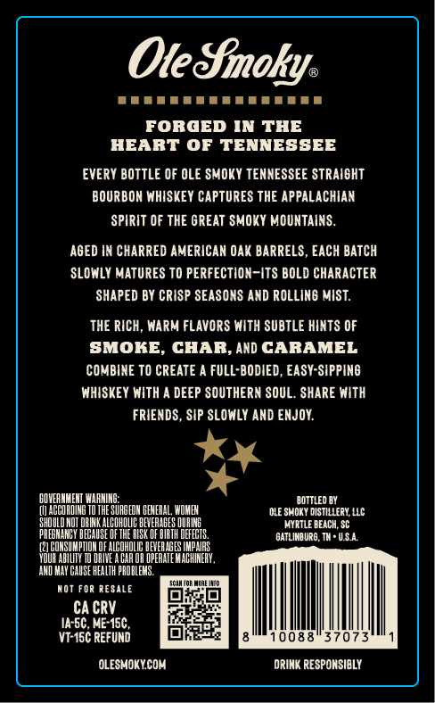
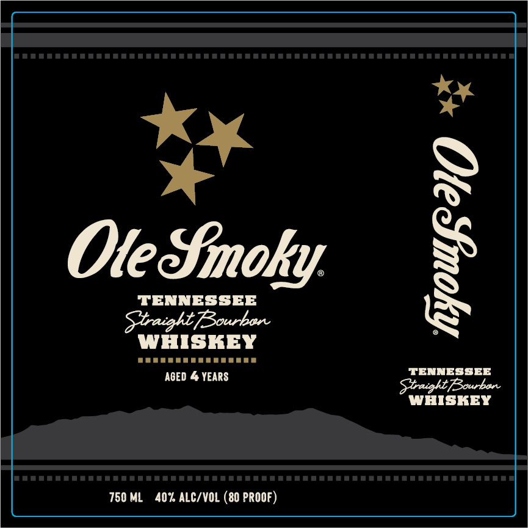

# TTB COLA Label Images - TTBID 26098001000098

**Brand Name:** OLE SMOKY

**Issue Date:** 04/09/2026

**Origin Code:** 41

**Product Class/Type:** 101

**Source:** [TTB Public COLA Registry](https://ttbonline.gov/colasonline/viewColaDetails.do?action=publicFormDisplay&ttbid=26098001000098)

## Label Images

### Back Label

### Label 1

## Extracted Label Text

*Text extracted via OCR - may contain errors*

### Back Label

Ole Sinoky.
rrr rite
FORGED IN THE
HEART OF TENNESSEE
EVERY BOTTLE OF OLE SMOKY TENNESSEE STRAIGHT
BOURBON WHISKEY CAPTURES THE APPALACHIAN
SPIRIT OF THE GREAT SMOKY MOUNTAINS.
AGED IN CHARRED AMERICAN OAK BARRELS, EACH BATCH
SLOWLY MATURES TO PERFECTION-ITS BOLD CHARACTER
‘SHAPED BY CRISP SEASONS AND ROLLING MIST.
THE RICH, WARM FLAVORS WITH SUBTLE HINTS OF
SMOKE, CHAR, AX) CARAMEL
COMBINE TO CREATE A FULL-BODIED, EASY-SIPPING
WHISKEY WITH A DEEP SOUTHERN SOUL. SHARE WITH
FRIENDS, SIP SLOWLY AND ENJOY.
‘GOVERNMENT WARNING: ‘BOTTLED BY
(1) ACCORDING TO THE SURGEON GENERAL, WOMEN ‘OLE SMOKY DISTILLERY, LLC
SHOULD NOT DRINK ALGOHOUG BEVERAGES DUNG MYRTLE BEACH, SC
‘PREGNANCY BECAUSE OF THE RISK OF BIRTH DEFEETS. ‘GATLINBURG, TH + U.S.A,
(2) GONSUMETION OF ALGOHOLIG BEVERAGES IMPAIRS
‘YOUR ABILITY TO ORIVE ACAR OR OPERATE MACHINERY,
AND MAY CAUSE HEALTH PROBLEMS.
vor ronaese = P™PERE
job}
CACRY Fea tty
Ua-5C, MEASC, eee
vrss¢ REFUND = LOLS FA Sots orate
‘OLESMOKY.COM DRINK RESPONSIBLY

### Label 1

ae

*«

a

*

e

Ole Smoky

s

TENNESSEE

PTT

WHISKEY

Stnaght Bourban

WHISKEY

( )
