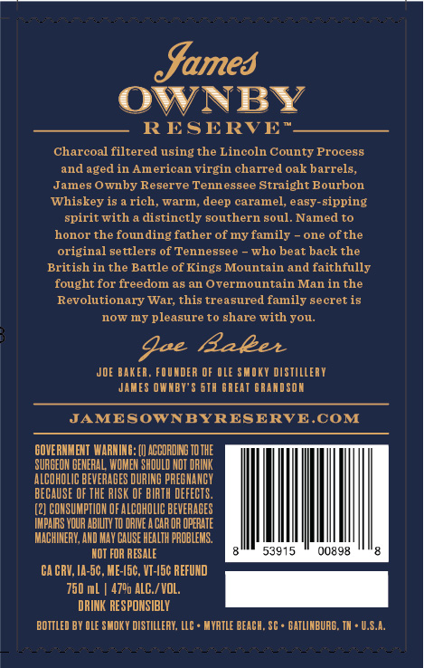

# TTB COLA Label Images - TTBID 26098001000105

**Brand Name:** JAMES OWNBY

**Fanciful Name:** RESERVE

**Issue Date:** 04/09/2026

**Origin Code:** 41

**Product Class/Type:** 101

**Source:** [TTB Public COLA Registry](https://ttbonline.gov/colasonline/viewColaDetails.do?action=publicFormDisplay&ttbid=26098001000105)

## Label Images

### Back Label

## Extracted Label Text

*Text extracted via OCR - may contain errors*

### Back Label

fumes
— RESERVE"
Charcoal filtered using the Lincoln County Process
and aged in American virgin charred oak barrels,
James Ownby Reserve Tennessee Straight Bourbon
Whiskey is a rich, warm, deep caramel, easy-sipping
spirit with a distinctly southern soul. Named to
honor the founding father of my family ~ one of the
original settlers of Tennessee - who beat back the
British in the Battle of Kings Mountain and faithfully
fought for freedom as an Overmountain Man in the
Revolutionary War, this treasured family secret is
now my pleasure to share with you.
gee Aaker
JOE BAKER, FOUNDER OF OLE SMOKY DISTILLERY
JAMES OWNBY'S STH GREAT GRANDSON
JAMESOWNBYRESERVE.COM
GOVERNMENT WARNING: (() ACCORDING TO THE
‘SURGEON GENERAL WOMEN SHOULD NOT DRINK
ALCOHOLIC BEVERAGES DURING PREGNANCY
BECAUSE OF THE RISK OF BIRTH DEFECTS.
(2) CONSUMPTION OF ALCOHOLIC BEVERAGES: | | | | | | |
{IMPAIRS YOUR ABILITY TO DRIVE A AR OR OPERATE
(MACHINERY, AND MAY CAUSE HEALTH PROBLEMS.
NOT FOR RESALE alll ssoi5 © ooage |e
GAGRU, IASC, ME-(5, VGC REFUND
DRINK RESPONSIBLY
BDTILED BY OLE SMOKY DISTILLERY, LS» MYRTLE BEAEH, SE» GATLINBURE, TH U.S.A.
