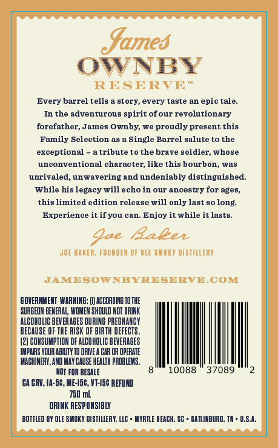
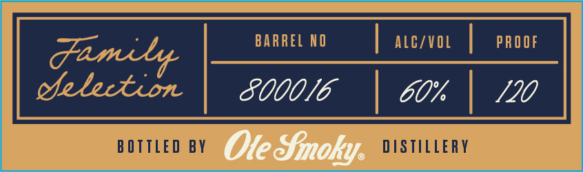
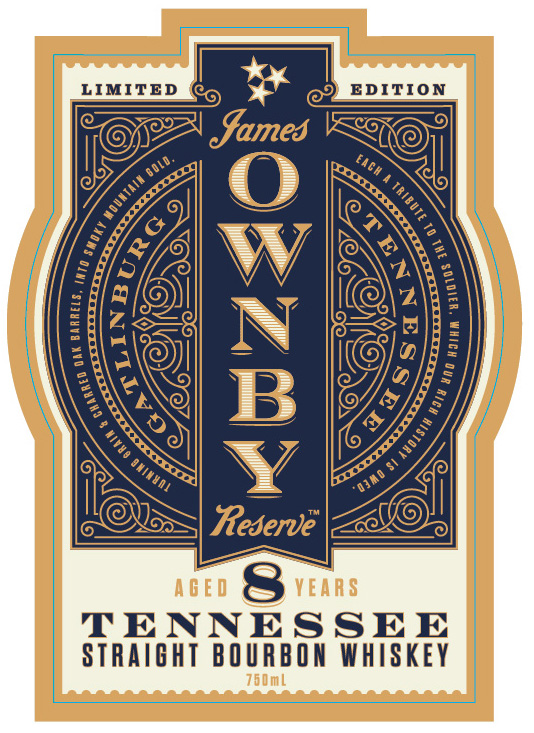
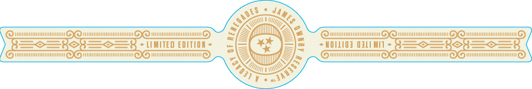

# TTB COLA Label Images - TTBID 26098001000109

**Brand Name:** JAMES OWNBY

**Fanciful Name:** RESERVE LIMITED EDITION

**Issue Date:** 04/13/2026

**Origin Code:** 41

**Product Class/Type:** 101

**Source:** [TTB Public COLA Registry](https://ttbonline.gov/colasonline/viewColaDetails.do?action=publicFormDisplay&ttbid=26098001000109)

## Label Images

### Back Label

### Front Label

### Label 1

### Label 4

### Label 5

## Extracted Label Text

*Text extracted via OCR - may contain errors*

*1 image(s) excluded: text did not meet readability threshold*

### Back Label

Sames
OWNBY
RESERVE "
Every barrel tells
story, every taste an epic tale:
In the adventurous spirit ofour revolutionary
forefather, James Ownby, we proudly present this
Family Selection a8
Single Barrel galute to the
exceptional
tribute to the brave soldier; whose
unconventional character; like this bourbon_
was
unrivaled, unwavering and undeniably distinguished:
While his legacy will echo in our ancestry for ages,
this limited
dition release will only last 80
Experience it ifyou can_
Enjoy it while it lasts__
Aae
Raeet
JOE BAKER: FOUNDER OF OLE SUOKY DISTILLERY
JAMEBOWNBYRESERVE COM
BOVERNMENT  WARNINE: [J ACCOAIIE TO THE
SURBEON BEHERAL WOMEM SHQULD NOT DRINK
ALCOHOL
BEVERABES DURINE PREOHAHCY
BECAUSE OF THE RISK OF BIRTH DEFECTS
(2] CONSUMPTION OF ALCOHOLIC
EVERABES
IMPAIAS YQUR ABILIY TO DRME
HAk UR UpERAIe
MACHINERY,AND MAY CauSe HEALTH
Rublehs.
NOT FOR RESALE
0088
37089
CA CRV, IA-5c, ME-46c , VT-46c REFUND
760 mL
DRINK RESPQHSIBLY
BOTTLED BY OLE SMDKY DI STILLERH; LLC
UYRILE DEACH; SC
BAILINBURO; TA + U.S.A:
long:

### Front Label

Family |_uaem | acco | meer
Cielection SOOOIE | GO% | S20
BOTTLED BY Ole Sinoky. DISTILLERY

### Label 1

= _ | =
eaeese > rt feg)_ EDITION
AGED Sri
TENNESSEE
STRAIGHT BOURBON WHISKEY

### Label 4

— FSFE FSF SSS
Samed Ounby tk

AGED Sims

RESERVE”
