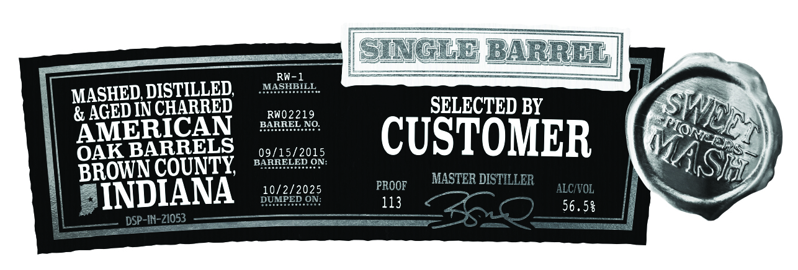

# TTB COLA Label Images - TTBID 26098001000128

**Brand Name:** HARD TRUTH DISTILLING CO.

**Issue Date:** 04/09/2026

**Origin Code:** 19

**Product Class/Type:** 101

**Source:** [TTB Public COLA Registry](https://ttbonline.gov/colasonline/viewColaDetails.do?action=publicFormDisplay&ttbid=26098001000128)

## Label Images

### Label 2

## Extracted Label Text

*Text extracted via OCR - may contain errors*

### Label 2

Suglb BARREL
RW-1
MASHED DISTILLED
MASHBILL
E AGED INCHARRED
RW02219
SELECTED BY
AMERICAN
BARREL
NO:
OAKBARRELS
09/15/2015
CUSTOMER
BROWN COUNTY
BARRELEE
Eene
ON:
10/2/2025
PROOF
MASTER DISTILLER
ALCIVOL
INDIANA
DUMPCD
113
56.58
DSP-IN-21053
SWICL
PION
MASH
ON:
