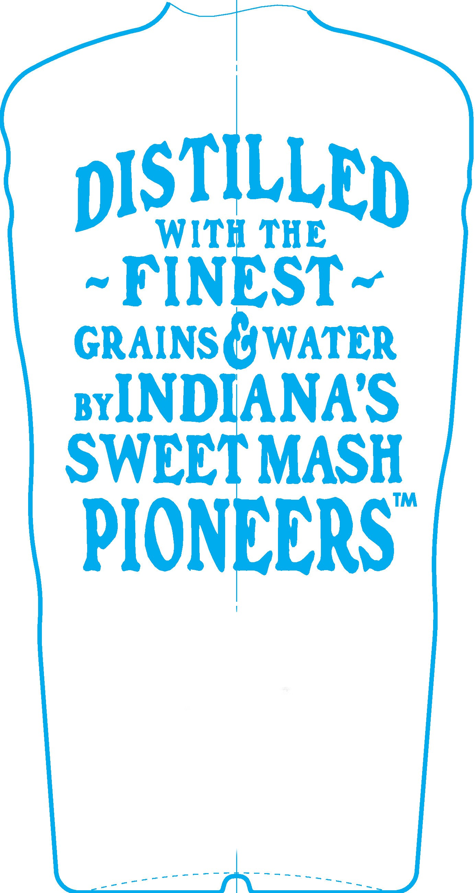
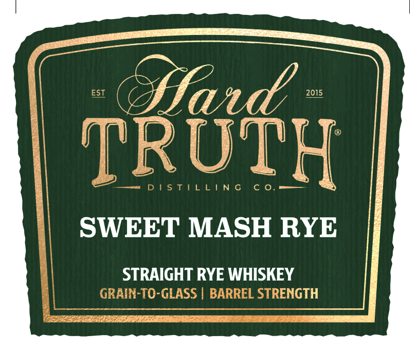
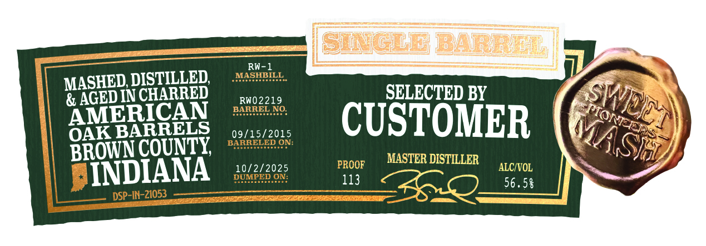
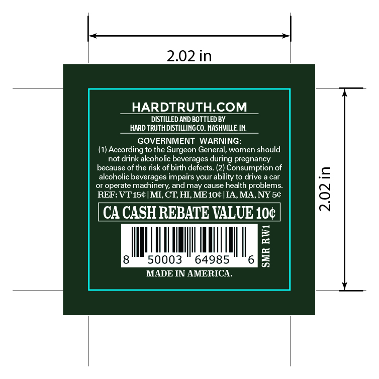

# TTB COLA Label Images - TTBID 26098001000161

**Brand Name:** HARD TRUTH DISTILLING CO.

**Issue Date:** 04/09/2026

**Origin Code:** 19

**Product Class/Type:** 101

**Source:** [TTB Public COLA Registry](https://ttbonline.gov/colasonline/viewColaDetails.do?action=publicFormDisplay&ttbid=26098001000161)

## Label Images

### Back Label

### Label 1

### Label 2

### Label 3

## Extracted Label Text

*Text extracted via OCR - may contain errors*

*1 image(s) excluded: text did not meet readability threshold*

**Detected Proof:** 113

### Label 1

Y gts j ii
CLT 1
z { , X SA di. ( 1 lk
I
SWEET MASH RYE !
STRAIGHT RYE WHISKEY :
HHL i

### Label 2

MASHED, DISTILLED, agentes,
& AGEDIN CHARRET

AMERI
ARRELS

PROOF
113

OAK B
BROWNCOUNTY, *
SINDIANA

DSP-IN-21053

SELECTED BY

MASTER DISTILLER

ALC/VOL
56.58

### Label 3

2.02 in

HARDTRUTH.COM

DISTILLED AND BOTTLED BY

HARD TRUTH DISTILLING CO. NASHVILLE. IN.

GOVERNMENT WARNIN

(1) According to the Surgeon G

ral, women should

not drink alcoholic beverag

during pregnancy

because of the ri

of birth defects. (2) Consumption of

alcohol

beve

jes impairs your ability to drive a

car

=

or operate m:

inery, and may cause health problems.

REF: VT 15¢| MI, CT, HI, ME10¢|IA, MA, NY 5¢

SIUM

TR =

50003

64985

MADE IN AMERICA.
