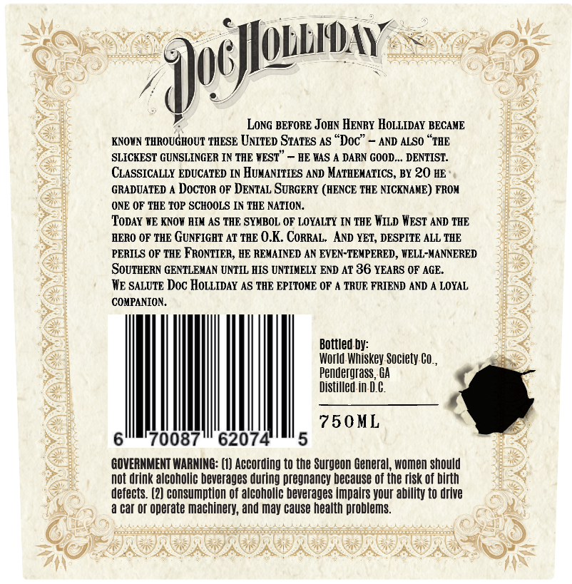
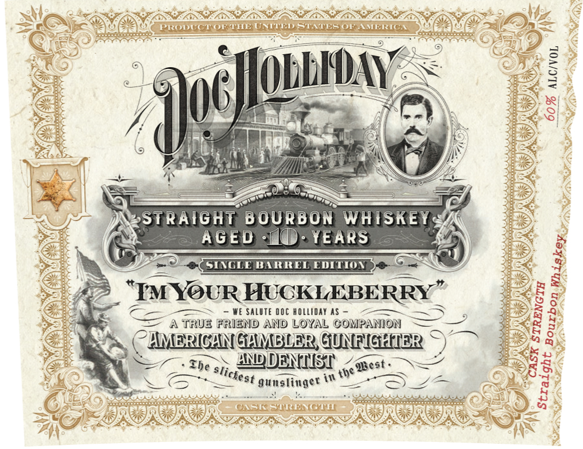

# TTB COLA Label Images - TTBID 26098001000166

**Brand Name:** DOC HOLLIDAY

**Issue Date:** 04/09/2026

**Origin Code:** 08

**Product Class/Type:** 101

**Source:** [TTB Public COLA Registry](https://ttbonline.gov/colasonline/viewColaDetails.do?action=publicFormDisplay&ttbid=26098001000166)

## Label Images

### Back Label

### Front Label

## Extracted Label Text

*Text extracted via OCR - may contain errors*

*1 image(s) excluded: text did not meet readability threshold*

**Detected Age:** 36 Years

### Back Label

=

=

cay me a fJobbIDAY

LonG BEFORE JOHN Henry HOLLIDAY ‘BECAME

KNOWN pis, a ‘THESE UNITED States AS “Doc” — AND ALSO “THE

SLICKEST GUNSLINGER IN THE WEST” — HE WAS A DARN GOOD... DENTIST.

CLASSICALLY EDUCATED IN HUMANITIES AND MATHEMATICS, BY 20 HE

GRADUATED A Doctor OF DENTAL SURGERY (HENCE THE NICKNAME) FROM

ONE OF THE TOP SCHOOLS IN THE NATION.

TODAY WE KNOW HIN AS THE SYMBOL OF LOYALTY IN THE WILD WEST AND THE

HERO OF THE GUNFIGHT AT THE 0.K. CORRAL. AND YET, DESPITE ALL THE

PERILS OF THE FRONTIER, HE REMAINED AN EVEN-TEMPERED, WELL-MANNERED

‘SOUTHERN GENTLEMAN UNTIL HIS UNTIMELY END AT 36 YEARS OF AGE.

WE SALUTE Doc HOLLIDAY AS THE EPITOME OF A TRUE FRIEND AND A LOYAL

COMPANION.

Bottled

World Whiskey. Society.¢o.

Z

Pendergrass, GA

Distilled in-D.¢.

750ML

Il

GOVERNMENT WARNING: (1) According to the Surgeon General, women should

Not drink alcoholic beverages during pregnancy because of the risk of birth

defects. (2} consumption of alcoholic beverages impairs your ability to drive

a Cat of operate machinery, and may cause health problems.

J

ne

or
