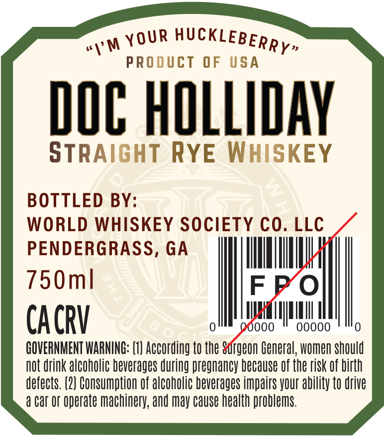
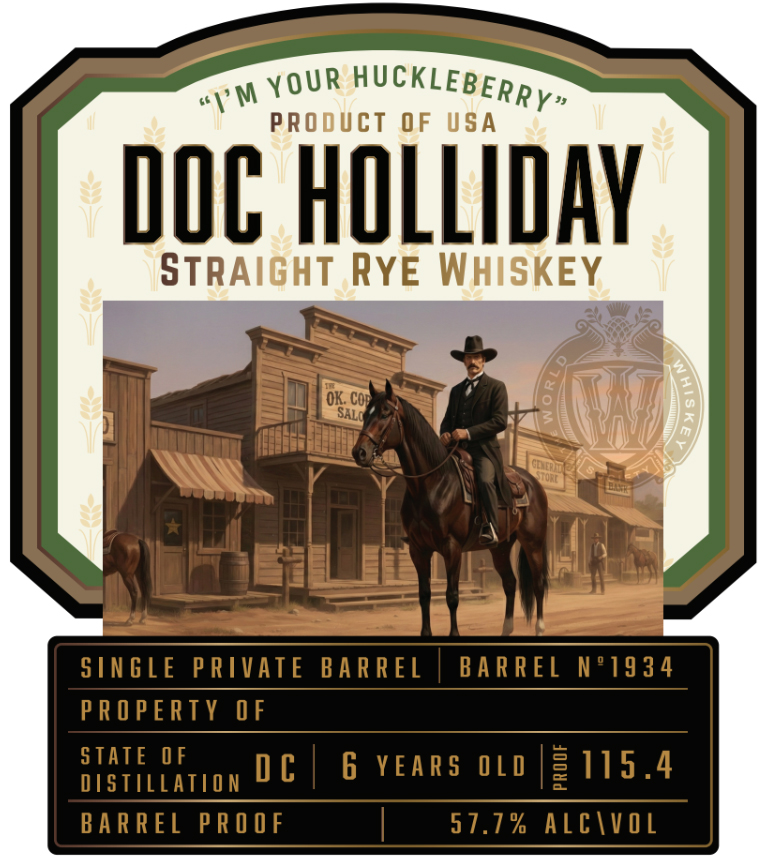

# TTB COLA Label Images - TTBID 26098001000187

**Brand Name:** DOC HOLLIDAY

**Issue Date:** 04/15/2026

**Origin Code:** 08

**Product Class/Type:** 102

**Source:** [TTB Public COLA Registry](https://ttbonline.gov/colasonline/viewColaDetails.do?action=publicFormDisplay&ttbid=26098001000187)

## Label Images

### Back Label

### Label 1

## Extracted Label Text

*Text extracted via OCR - may contain errors*

**Detected Proof:** 115.4
**Detected Age:** 6 Years

### Back Label

PRODUCT
0F
USA
DOC HOLLIAY
STRAIGHT RYE WHISKEY

BOTTLED BY:

WORLD WHISKEY SOCIETY €O. LLC
PENDERGRASS, GA
750ml
CACRV
0ooo
0o0o0
GOVERNMENT WARNING: (1) According to the Sargeon General, women should
not drink alcoholic beverages during pregnancy because Of the risk Of birth
defects. (2} Consumption Of alcoholic beverages impairs your ability to drive
a Car Or operate machinery, and may Cause health problems:
HUcKLEBERRY"
YOUR
1'M

### Label 1

1'm
PROducT OF USA
DOC HOLLIDAY
STRAIGHT RYE WHISKEY
OK: Con
SALO
SIN GLE PRIVATE
BA R REL
BA R REL
N 91934
PR O PERTY OF
STATE OF
0 €
6 YEAR $
0 L 0
3115.4
DISTILLATION
BA R REL PRO OF
57.7% AlcivoL
HUCKLEBERRY"
YOUR
