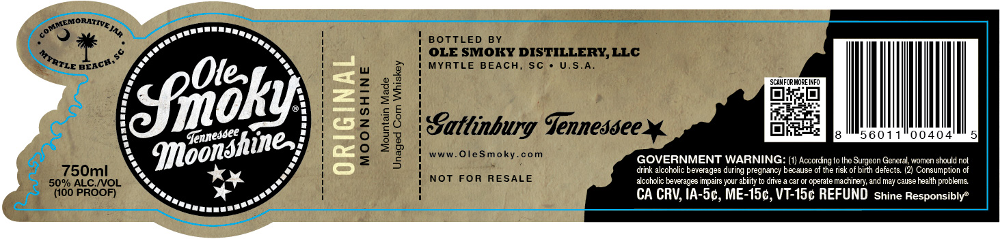
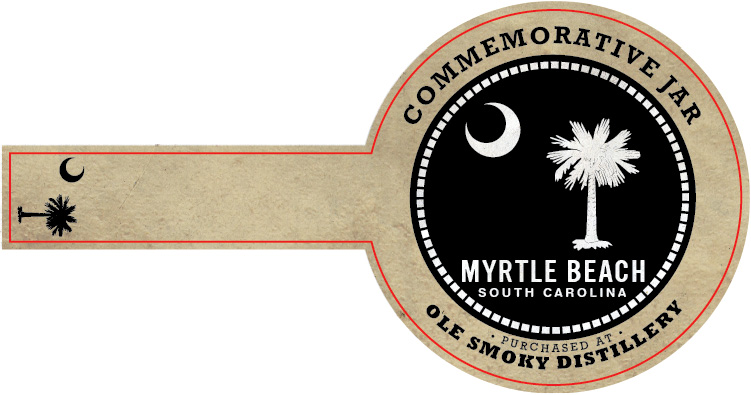

# TTB COLA Label Images - TTBID 26098001000193

**Brand Name:** OLE SMOKY

**Fanciful Name:** ORIGINAL MOONSHINE

**Issue Date:** 04/09/2026

**Origin Code:** 41

**Product Class/Type:** 143

**Source:** [TTB Public COLA Registry](https://ttbonline.gov/colasonline/viewColaDetails.do?action=publicFormDisplay&ttbid=26098001000193)

## Label Images

### Label 1

### Label 2

## Extracted Label Text

*Text extracted via OCR - may contain errors*

**Detected Proof:** 100

### Label 1

JMNSMORATIVE MA;
BOTTLED
BY
OLE SMOKY DISTILLERY,LLC
MYRTLE
BEACH.
Sc
U.S.A_
[
SCANFCR MORE INFQ
(Snok) |

Satlinburg Tennessee
5601
0040
1
]
ww.OleSmoky_
GOVERNMENT WARNING: (1) According to the Surgeon General women should not
750ml
drink alcoholic beverages during pregnancy because of the risk of birth defects
(21 Consumption of
so% ALC NOL
not
FOR
RESALE
alcoholic beverages impairs your ability t0 dnve _
Aio
machinery; and may causehealth problems
(100 PrOOF)
CA CRV; IA-Sc, ME-15c, VT-1Sc REFUND Shine Responsiblye
MYRTLE }
BEACH,
ICnnesdee
Ioonshine
cperate_

### Label 2

MYRTLE BEACH_
South CAROLINA
PuRChiserAX
G2EMorarr
5
DiSTiiLERy
OLE
SMOKY
