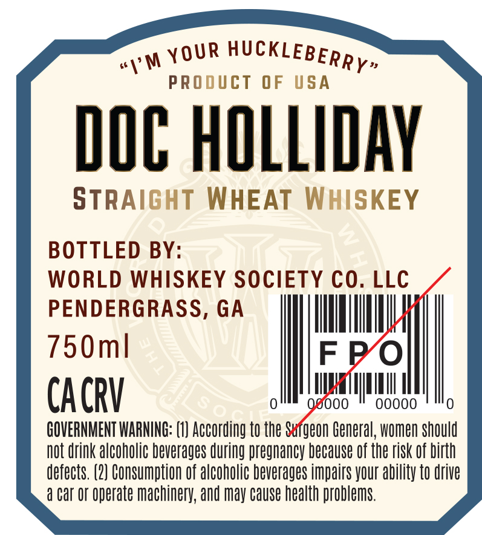
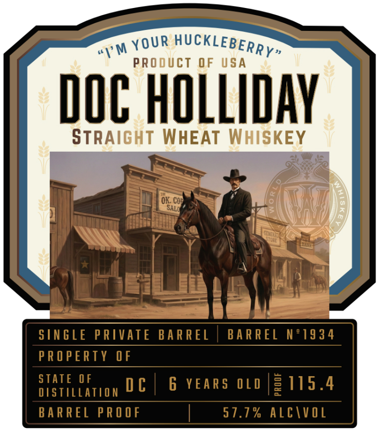

# TTB COLA Label Images - TTBID 26098001000196

**Brand Name:** DOC HOLLIDAY

**Issue Date:** 04/15/2026

**Origin Code:** 08

**Product Class/Type:** 109

**Source:** [TTB Public COLA Registry](https://ttbonline.gov/colasonline/viewColaDetails.do?action=publicFormDisplay&ttbid=26098001000196)

## Label Images

### Back Label

### Label 1

## Extracted Label Text

*Text extracted via OCR - may contain errors*

**Detected Proof:** 115.4
**Detected Age:** 6 Years

### Back Label

wy YOUR HUCKLEBER»,

PRO

JCT OF

SA

DOC HOLLIDAY

STRA

WHEAT |

BOTTLED BY

WORLD WHISKEY SOCIETY CO. LLC

PENDERGRASS, GA

IMT

m

FPO

CACRV

0)

Qg@000

MTN

00000

0)

GOVERNMENT WARNING: (1) According to the Sufgeon General, women should

not drink alcoholic beverages during pregnancy because of t the risk of birth

defects. (2) Consumption of alcoholic beverages impairs your ability to drive

4 Car Or operate machinery, and may cause health problems.

### Label 1

PRoduct OF
USA
DOC HOLLIDAY
StRAIGHT WHEAT WHISKEY
OK: Coe
SALO
SIN GLE PRIVATE BARREL
BA R REL N91934
PRO PERTY OF
STATE OF
D €
6 YEAR S
0 L D
3115.4
DSTILATION
BA R REL PR O OF
57.7 % AlcivoL
HUcKLEBERRY"
YOUR
"1'M
