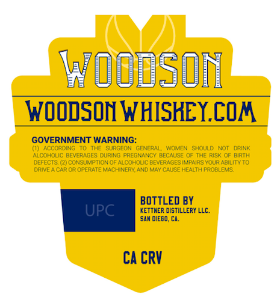
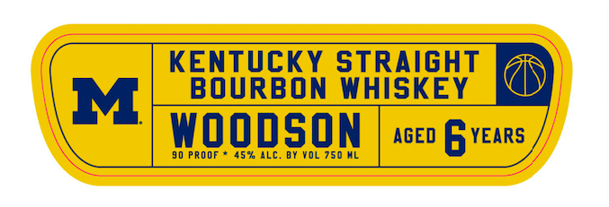
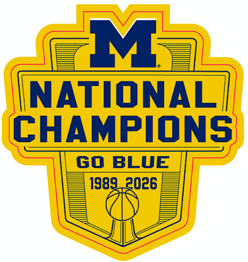

# TTB COLA Label Images - TTBID 26098001000336

**Brand Name:** WOODSON

**Issue Date:** 04/09/2026

**Origin Code:** 01

**Product Class/Type:** 101

**Source:** [TTB Public COLA Registry](https://ttbonline.gov/colasonline/viewColaDetails.do?action=publicFormDisplay&ttbid=26098001000336)

## Label Images

### Back Label

### Front Label

### Label 3

## Extracted Label Text

*Text extracted via OCR - may contain errors*

*1 image(s) excluded: text did not meet readability threshold*

**Detected Proof:** 90

### Back Label

koodson
WOODSON WHISKEY.COA
GOVERNMENT WARNING:
ACCCRDING
THE
SuRGEOT
GENERAL,;
WOMEN  SHOULD
NoT
CRINK
ALCOHOLIC BEVERAGES DURING PREGNANCY BECAUSE OF THE RIS< OF BIRTH
DEFECTS (2) CONSUMPTION OF ALCOHOLIC BEVERAGES I"'PAIRS YOUR AbiLiTYTO
ORIE A CAR OR OPERATEMACHINERY ANDMAAY CAUSE HEALTH PROBLEMS:
BOTTLED BY
UPC
KETThER DISTILLERY LLC;
San CiegD cAa.
ca CRV

### Front Label

KENTUcKY STRAIGHT
M
BOURBON WHISKEY
Woodson
AGED
YEARS
90 PROOF
45% ALc.
BY YOL 750 HL
