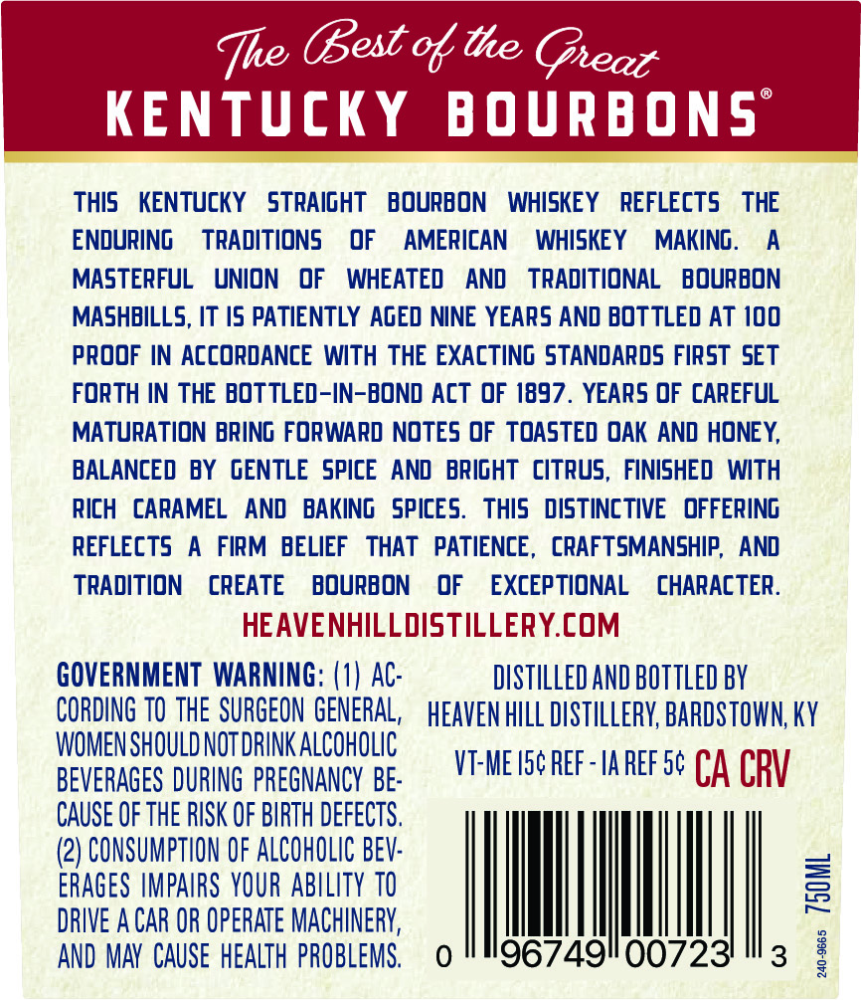

# TTB COLA Label Images - TTBID 26098001000428

**Brand Name:** HEAVEN HILL

**Fanciful Name:** BOTTLED-IN-BOND DOUBLE MASH

**Issue Date:** 04/09/2026

**Origin Code:** 22

**Product Class/Type:** 111

**Source:** [TTB Public COLA Registry](https://ttbonline.gov/colasonline/viewColaDetails.do?action=publicFormDisplay&ttbid=26098001000428)

## Label Images

### Back Label

## Extracted Label Text

*Text extracted via OCR - may contain errors*

**Detected Proof:** 100

### Back Label

Te Gest othe Geaz
KENTUcky
B OURB ONS
this
KENTUCKY
STRAIgHT
BOURBON
WHISKEY
REFLEcTS
THE
ENDURING
TRADITIONS
OF
AMERICAN
WHISKEY
MAKING.
A
MASTERFUL
UNION
OF
WHEATED
AND
TRADITIONAL
BOuRBON
MASHBILLS, IT /5 PATIENTLY AGED NINE YEARS AND BOT TLED AT 100
proOF IN AccORDAnce With THE EXACTING STANDARDS FIRST SET
FORTH IN THE BOTTLED-IN-BOND AcT OF 1897 . YEARS OF CAREFUL
MATURATION BRING FORWARD NOTES OF TOASTED OAK AND HONEY,
BALANCED BY GENTLE SPICE AND   BRIgHT  citrus, FINISHED  WITH
RICH   CARAMEL
AND   BAKING  SPICES:
this   DISTiNcTIVE   OFFERING
REFLECTS
A
FIRM  BELIEF
THAT   PATIENCE ,
CRAFTSMANSHIP,   AND
TRADITION
CREATE
BOURBON
OF
EXCEPTIONAL
CHARACTER.
HEAVENHILLDISTILLERY.COM
GOVERNMENT  WARNING; (1) AC:
DISTILLED AnD bottled bY
CORDING TO ThE SURGEON GENERAL,
HEAVEN hILL DiStILLERY, BARDSTOWN; KY
WOMEN SHOULD NOT DRINK ALCOHOLIC
BEVERAGES DURING PREGNANCY BE:
VT-ME Isc REf-Ia REf 5c CA CRV
CAUSE OF THE RISK OF BIRTH DeFECTS,
(2) CONSUMPTION OF AlCohOlic BEV:
ERAGeS IMPAIRS YOUR ABILITY TO
2
DRIVE A CAR OR OperATe MACHINERV;
AND MAY  CAUSE HEALTH PROBLEMS.
0
967491007231
3
1
