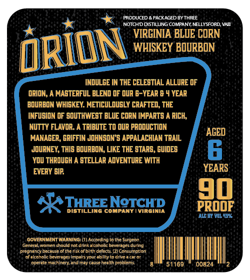
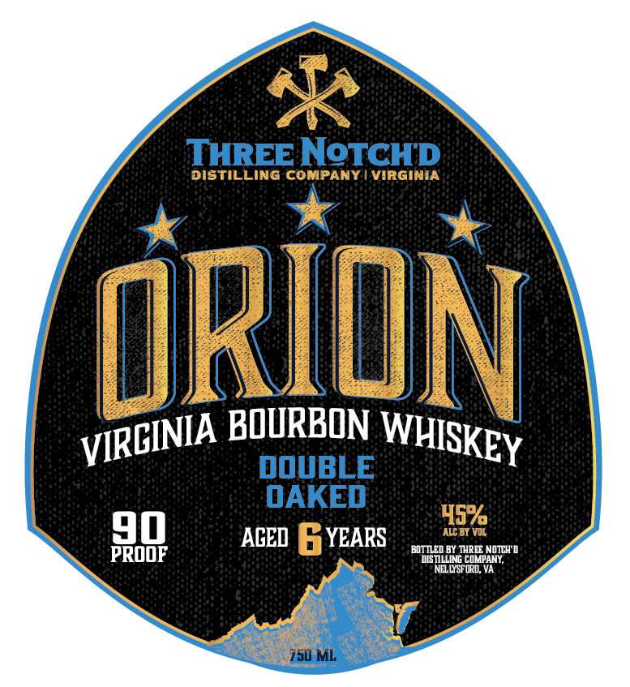

# TTB COLA Label Images - TTBID 26098001000568

**Brand Name:** THREE NOTCH'D DISTILLING COMPANY

**Fanciful Name:** ORION DOUBLE OAKED

**Issue Date:** 04/10/2026

**Origin Code:** 05

**Product Class/Type:** 141

**Source:** [TTB Public COLA Registry](https://ttbonline.gov/colasonline/viewColaDetails.do?action=publicFormDisplay&ttbid=26098001000568)

## Label Images

### Back Label

### Front Label

## Extracted Label Text

*Text extracted via OCR - may contain errors*

**Detected Proof:** 90
**Detected Age:** 4 Years

### Back Label

FRODUCED
PACKAGED BY THREE
NOTCHDDISTILUNG COMPANY NELLYSFORD VAD
VIRCINIA BLVE CORN
WHISKEY BOURBON
INDULCE IN THE CELESTIAL ALLURE OF
ORION, A MASTERFUL BLEND OF QUR 6-YEAR & 4 YEAR
BOURBON WHISKEY: METICULOUSLY CRAFTED, THE
INFUSION 0F SOUTHWEST BLUE CORN IMPARTS A RICH
NuTTY FLavIR:
TRIBUTE T0 OUR PRODUCTION
ACED
MANACER, GRIFFIN JOHNSON S APPALACHIAN TRAIL
JOvRNEY; THIS BOURBON LIKE THE STARS, GUIDES
Yov THROUGH A STELLAR ADVENTURE WITH
EVERY SIP
YEARS
1
THREENeTcHD
PROOF
DistIlLIng COMPAny
VIrgInia
AGBi YMl457
GOVERNMENT WARNING: (1) According
tnaSurgcon
nomen should not drinkalcoholic beverages during
pregnancy bectuie ofthcrisk ol birth delcru (2) Consumption
ofakoholic beverages impalrsyourabllity to dmve acar
opcrate mechinery; endmay causc health problems
51169
00824
DRION
Geca

### Front Label

THREE NoTCHD
distilLinG COMPANY | VirGInia
ORIDN
BOURBON
DOuBLE
OAKED
45%
90
ACED
YEARS
ALC BY VOL
BOTTLED BY THREE NiCH 0
PROOF
DISTILLING COMPANY;
NELLYSFORD; VA
150 ML
VIRCINIA
WHISKEY
