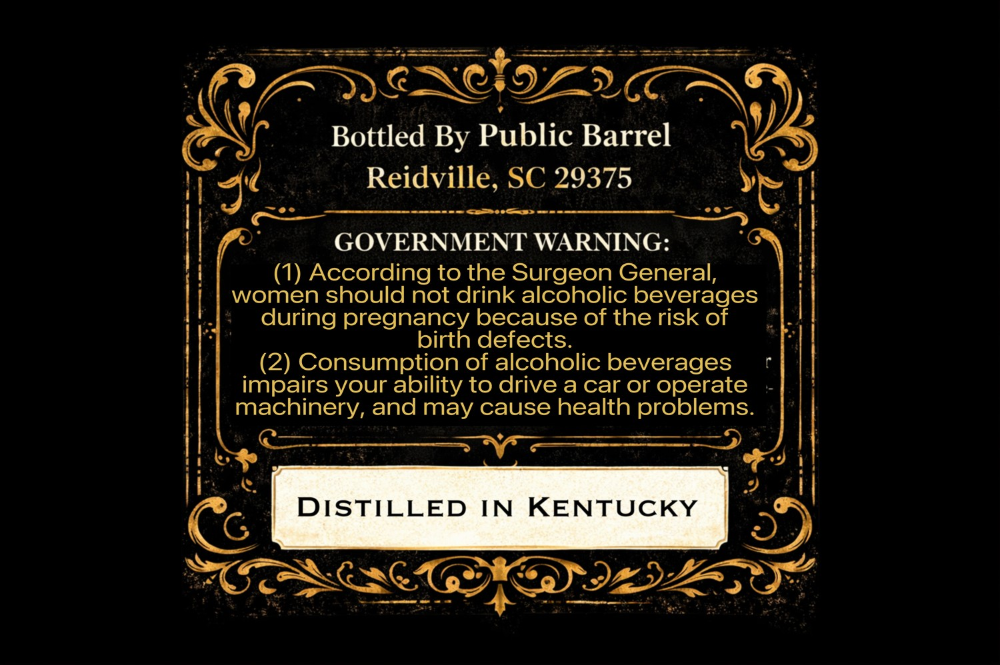
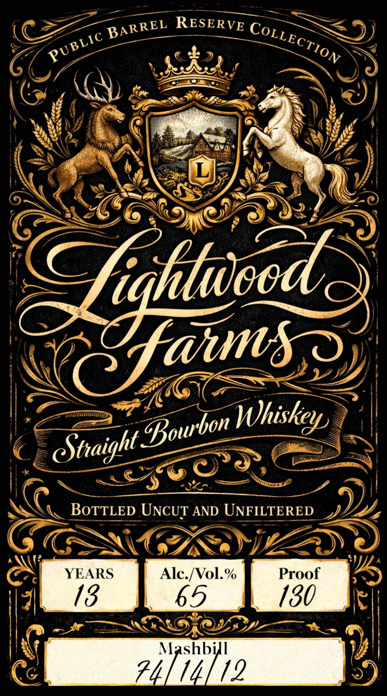

# TTB COLA Label Images - TTBID 26098001000584

**Brand Name:** LIGHTWOOD FARMS

**Issue Date:** 04/15/2026

**Origin Code:** 41

**Product Class/Type:** 101

**Source:** [TTB Public COLA Registry](https://ttbonline.gov/colasonline/viewColaDetails.do?action=publicFormDisplay&ttbid=26098001000584)

## Label Images

### Back Label

### Front Label

## Extracted Label Text

*Text extracted via OCR - may contain errors*

### Back Label

Bottled By Public Barrel
Reidville, SC 29375
GOVERNMENT WARNING:
(1) According to the Surgeon General,
women should not drink alcoholic beverages
during
because of the risk of
pregnaick
defects:
(2) Consumption of alcoholic beverages
impairs your ability to drive a car or operate
machinery, and may cause health problems:
DISTILLED
IN
KENTUCKY

### Front Label

RESERVE
L
hightweode
Whiskeys
CSttaight
BoTTLED UNCUT AND UNFILTERED
YEARS
Alc.[Vol: %
Proof
18
65
180
Mashbill
74]16112
BARREL
CoLLECTION
PUBLIC
@faums .
Bowrbon
