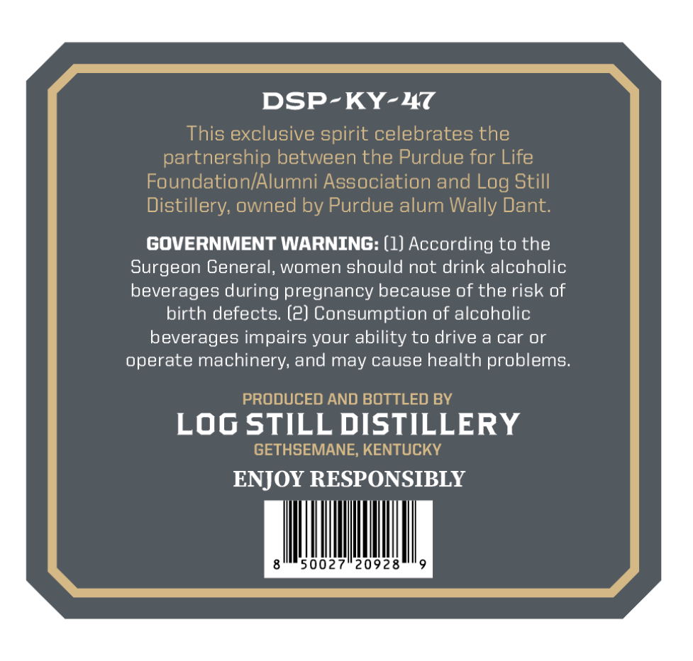
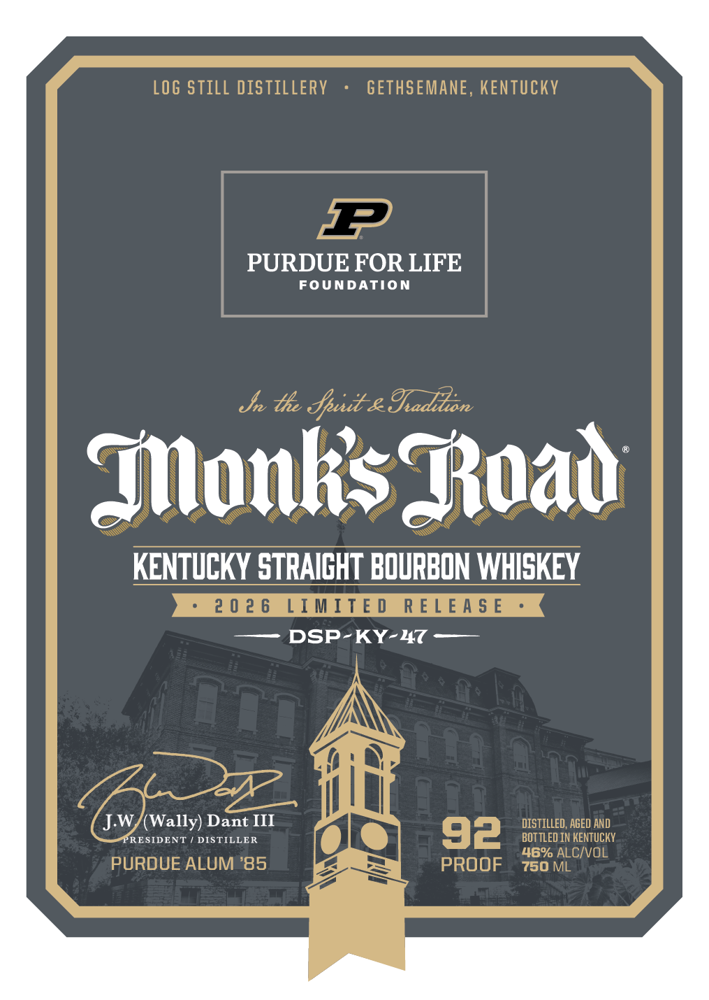
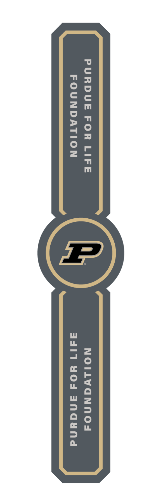

# TTB COLA Label Images - TTBID 26098001000621

**Brand Name:** MONK'S ROAD

**Issue Date:** 04/09/2026

**Origin Code:** 22

**Product Class/Type:** 101

**Source:** [TTB Public COLA Registry](https://ttbonline.gov/colasonline/viewColaDetails.do?action=publicFormDisplay&ttbid=26098001000621)

## Label Images

### Back Label

### Front Label

### Label 2

## Extracted Label Text

*Text extracted via OCR - may contain errors*

**Detected Proof:** 92

### Back Label

DSP-KY-47
This exclusive spirit celebrates the
partnership between the Purdue for Life
Foundation/Alumni Association and Log Still
Distillery; owned by Purdue alum Wally Dant:
GOVERNMENT WARNING: (1) According to the
Surgeon General, women should not drink alcoholic
beverages during pregnancy because f the risk of
birth defects: (2) Consumption of alcoholic
beverages impairs your ability to drive
a car Or
operate machinery; and may cause health problems__
PRODUCED AND BOTTLED BY
Log STILL DISTILLERY
GETHSEMANE; KENTUCKY
ENJOY RESPONSIBLY
50027*20928

### Front Label

LOG STILL distillery
GETHSEMANE , KENTUCKY
1
PURDUE FOR LIFE
FOUNDATION
Jn the Jpui & Iadikon
MonksJaad
KENTUCKY STRAICHT BOURBON WHISKEY
2 0 2 6
LIMITE 0
R E L E A $ E
DSP-KY-47
J.W
Wally) Dant III
DISTILLED, AGED AND
PRESIDENT
DISTILLER
92
BOT TLED IN KENTUCKY
46% ALCIVOL
PURDUE ALUM '85
PROOF
750 ML

### Label 2

PURDUE FOR LIFE NOILVGNNOd

FOUNDATION a4d17 ¥WOd ANGHUNG
