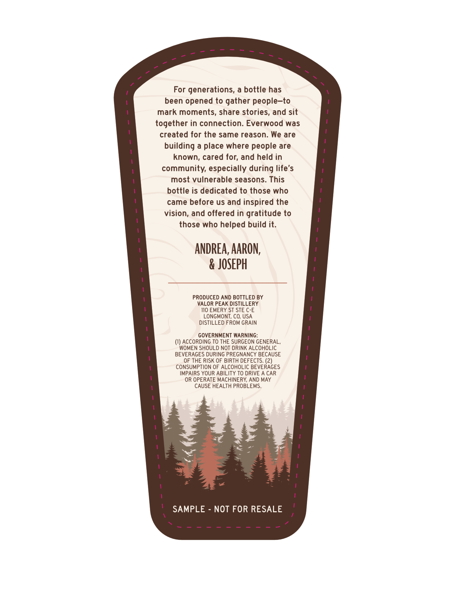
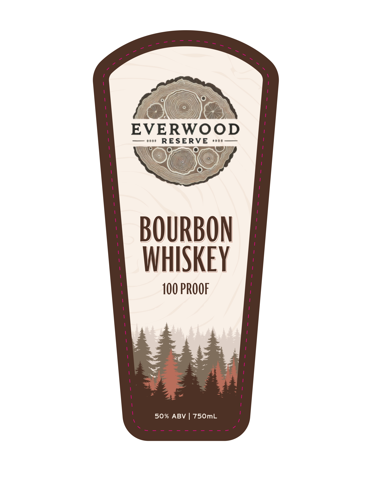

# TTB COLA Label Images - TTBID 26099001000083

**Brand Name:** EVERWOOD RESERVE

**Issue Date:** 04/16/2026

**Origin Code:** 13

**Product Class/Type:** 141

**Source:** [TTB Public COLA Registry](https://ttbonline.gov/colasonline/viewColaDetails.do?action=publicFormDisplay&ttbid=26099001000083)

## Label Images

### Back Label

### Front Label

## Extracted Label Text

*Text extracted via OCR - may contain errors*

**Detected Proof:** 100

### Back Label

For generations, a bottle has
been opened to gather people-to
mark moments, share stories, and sit
together in connection: Everwood was
created for the same reason: We are
building a place where people are
known; cared for; and held in
community, especially during life's
most vulnerable seasons. This
bottle is dedicated to those who
came before us and inspired the
vision, and offered in gratitude to
those who helped build it.
AndRea, AARON,
& JOSEPH
PRODUCED AND BOTTLED BY
VALOR PEAK DISTILLERY
IIO EMERY ST STE C-E
LONGMONT; CO, USA
DISTILLED FROM GRAIN
GOVERNMENT WARNING:
(I) ACCORDING TO THE SURGEON GENERAL,
WOMEN SHOULD NOT DRINK ALCOHOLIC
BEVERAGES DURING PREGNANCY BECAUSE
OF THE RISK OF BIRTH DEFECTS. (2)
CONSUMPTION OF ALCOHOLIC BEVERAGES
IMPAIRS YOUR ABILITY TO DRIVE A CAR
OR OPERATE MACHINERY; AND MAY
CAUSE HEALTH PROBLEMS.
SAMPLE
NOT FOR RESALE

### Front Label

EVERWOOD

eooe aot

BOUR

WHISKE

100 PROOF

50% ABV | 750mL
