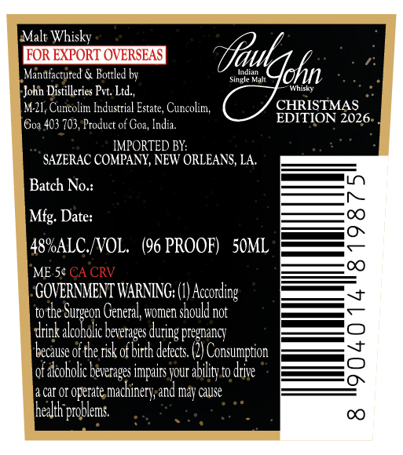
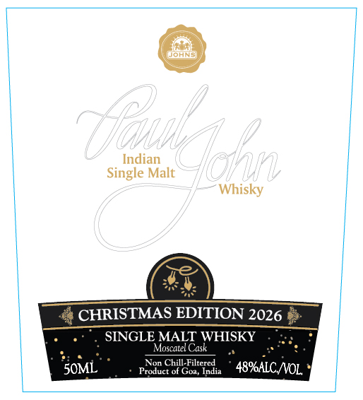

# TTB COLA Label Images - TTBID 26099001000304

**Brand Name:** PAUL JOHN

**Issue Date:** 04/10/2026

**Origin Code:** 5I

**Product Class/Type:** 118

**Source:** [TTB Public COLA Registry](https://ttbonline.gov/colasonline/viewColaDetails.do?action=publicFormDisplay&ttbid=26099001000304)

## Label Images

### Back Label

### Front Label

## Extracted Label Text

*Text extracted via OCR - may contain errors*

**Detected Proof:** 96

### Back Label

Malt Whisky
FOR EXPORT OVERSEAS
{autghn
Manafactured & Bottled by
~nre KAIL
John Distilleries Pvt: Ltd,,
Sins
M2l, Cuncolim Industrial Estate, Curcolim;
CHRISTMAS
Goa 403 703, Product of Goz, India.
EDITION 2026
IMPORTED BY:
SAZERAC COMPANY; NEW ORLEANS, LA,
Batch No:
Mfg: Date:
48ALC /VOL.  (96 PROOF)   5OML
8
ME 54 CA CRV
C
GOVERMMENT WARNING;
According
to the
General, women should not
drink alcoholic
pregnancy
because o5 the risk ot birth detects;
Consumption
1
of akcoholic beverages impaits your ability to drive
Cat OI operate
machinery, and may cause
health problems:
C
Surgeon !
beveraces =
 during "

### Front Label

WoHNs
Indian
Single Malt
Whisky
CHRISTMAS EDITION 2026
SINGLE MALT WHISKY
Moscatet Cask
SOML
ProduccbilGlreredi
India
48%ALC NNOL
~oukdaho
